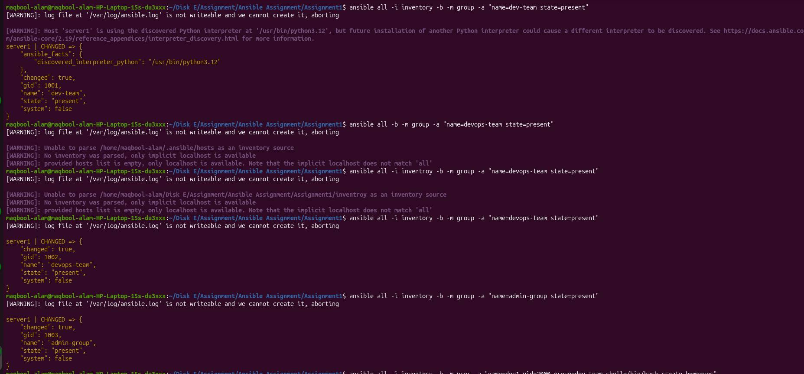
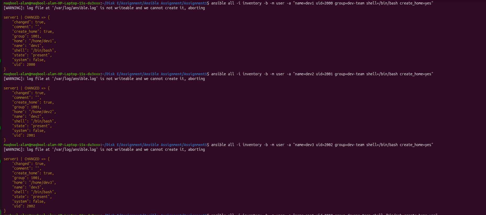
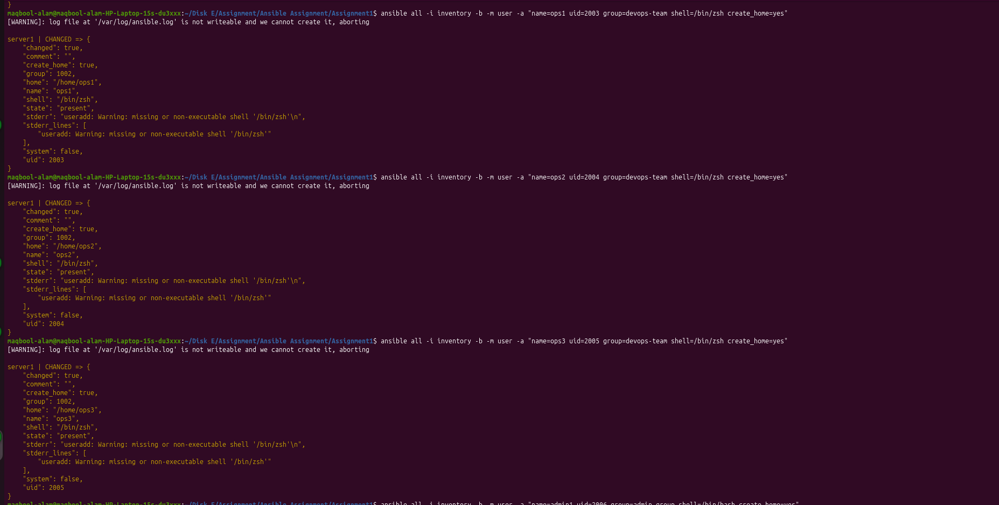
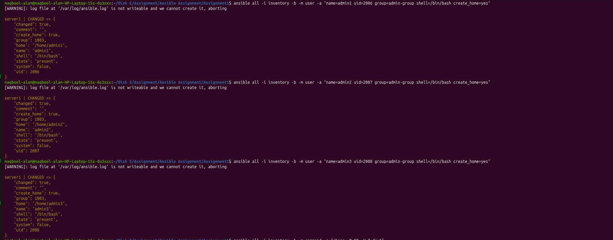
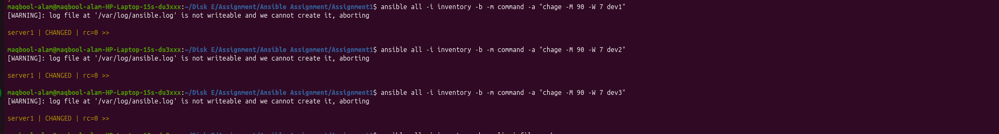
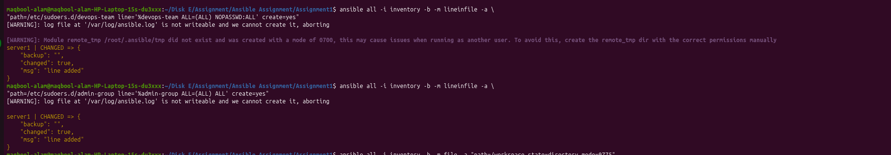
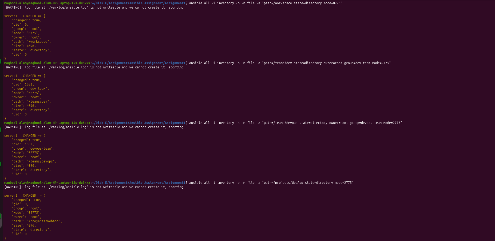
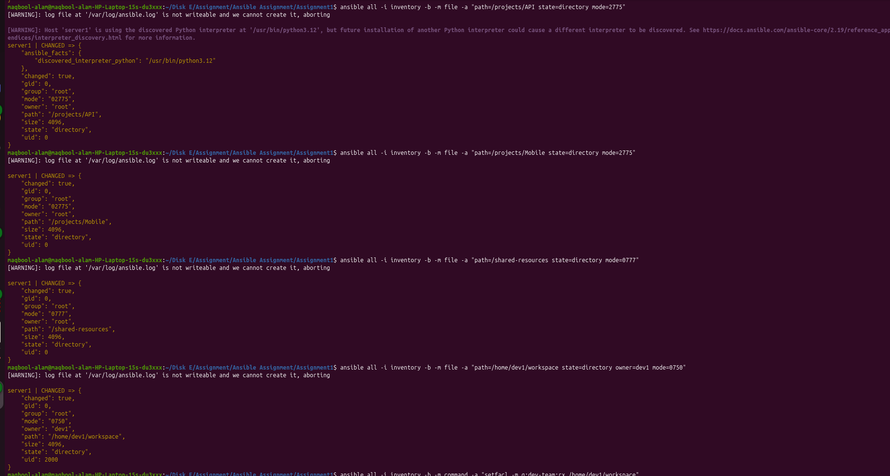
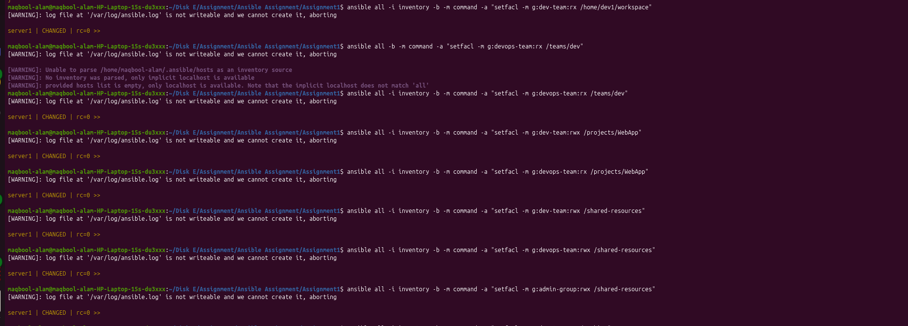
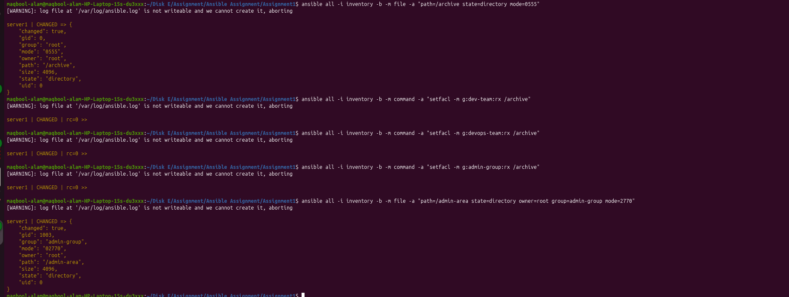

# 🚀 Ansible Assignment-1 — UserManager (Adhoc Commands Only)

## 📌 Project Overview

The system automates:

* Team & User Management
* Security Policies
* Directory Structure Creation
* Permission Matrix Implementation
* Collaboration Environment Setup


# 👥 Team Structure

| Team             | Group Name  |
| ---------------- | ----------- |
| Development Team | dev-team    |
| DevOps Team      | devops-team |
| Admin Team       | admin-group |

---

# 1️⃣ Create Groups

## Purpose

Creates Linux groups representing organizational teams.

```bash
ansible all -b -m group -a "name=dev-team state=present"
ansible all -b -m group -a "name=devops-team state=present"
ansible all -b -m group -a "name=admin-group state=present"
```



---

# 2️⃣ Create Users (Custom UID)

## Purpose

* Adds users to teams
* Assigns shells
* Creates home directories

---

## Development Team

```bash
ansible all -b -m user -a "name=dev1 uid=2000 group=dev-team shell=/bin/bash create_home=yes"
ansible all -b -m user -a "name=dev2 uid=2001 group=dev-team shell=/bin/bash create_home=yes"
ansible all -b -m user -a "name=dev3 uid=2002 group=dev-team shell=/bin/bash create_home=yes"
```


---

## DevOps Team

```bash
ansible all -b -m user -a "name=ops1 uid=2003 group=devops-team shell=/bin/zsh create_home=yes"
ansible all -b -m user -a "name=ops2 uid=2004 group=devops-team shell=/bin/zsh create_home=yes"
ansible all -b -m user -a "name=ops3 uid=2005 group=devops-team shell=/bin/zsh create_home=yes"
```



---

## Admin Group

```bash
ansible all -b -m user -a "name=admin1 uid=2006 group=admin-group shell=/bin/bash create_home=yes"
ansible all -b -m user -a "name=admin2 uid=2007 group=admin-group shell=/bin/bash create_home=yes"
ansible all -b -m user -a "name=admin3 uid=2008 group=admin-group shell=/bin/bash create_home=yes"
```



---

# 3️⃣ Password Expiry Policy

## Purpose

Enforces security password rotation.

```bash
ansible all -b -m command -a "chage -M 90 -W 7 dev1"
```



✔ Password expires after **90 days**
✔ Warning shown **7 days before expiry**

---

# 4️⃣ Configure Sudo Access

## DevOps Team (Passwordless sudo)

```bash
ansible all -b -m lineinfile -a \
"path=/etc/sudoers.d/devops-team line='%devops-team ALL=(ALL) NOPASSWD:ALL' create=yes"
```

## Admin Group (Full sudo)

```bash
ansible all -b -m lineinfile -a \
"path=/etc/sudoers.d/admin-group line='%admin-group ALL=(ALL) ALL' create=yes"
```




---

# 5️⃣ Directory Structure

---

## Workspace Root

```bash
ansible all -b -m file -a "path=/workspace state=directory mode=0775"
```

---

## Team Collaboration Directories

```bash
ansible all -b -m file -a "path=/teams/dev state=directory owner=root group=dev-team mode=2775"
ansible all -b -m file -a "path=/teams/devops state=directory owner=root group=devops-team mode=2775"
```

📌 `2` → SGID ensures inherited group ownership.

---

## Project Directories

```bash
ansible all -b -m file -a "path=/projects/WebApp state=directory mode=2775"
ansible all -b -m file -a "path=/projects/API state=directory mode=2775"
ansible all -b -m file -a "path=/projects/Mobile state=directory mode=2775"
```

---

## Shared Resources

Accessible by all teams.

```bash
ansible all -b -m file -a "path=/shared-resources state=directory mode=0777"
```

---

## Archive Directory (Read Only)

```bash
ansible all -b -m file -a "path=/archive state=directory mode=0555"
```

---

## Admin Area

```bash
ansible all -b -m file -a "path=/admin-area state=directory owner=root group=admin-group mode=2770"
```

---

# 6️⃣ Personal Workspace Setup

## Purpose

Creates workspace inside user home directory.

```bash
ansible all -b -m file -a "path=/home/dev1/workspace state=directory owner=dev1 mode=0750"
```




---

# 7️⃣ Security Permission Matrix (ACL)

ACL provides advanced permissions.

---

## Personal Workspace

Owner full access, team read access.

```bash
ansible all -b -m command -a "setfacl -m g:dev-team:rx /home/dev1/workspace"
```

---

## Team Directory Permissions

Other teams read-only.

```bash
ansible all -b -m command -a "setfacl -m g:devops-team:rx /teams/dev"
```

---

## Project Directory Access

Example: WebApp Project

```bash
ansible all -b -m command -a "setfacl -m g:dev-team:rwx /projects/WebApp"
ansible all -b -m command -a "setfacl -m g:devops-team:rx /projects/WebApp"
```

---

## Shared Resources Access

```bash
ansible all -b -m command -a "setfacl -m g:dev-team:rwx /shared-resources"
ansible all -b -m command -a "setfacl -m g:devops-team:rwx /shared-resources"
ansible all -b -m command -a "setfacl -m g:admin-group:rwx /shared-resources"
```



---

## Archive Directory (Read Only)

```bash
ansible all -b -m command -a "setfacl -m g:dev-team:rx /archive"
ansible all -b -m command -a "setfacl -m g:devops-team:rx /archive"
ansible all -b -m command -a "setfacl -m g:admin-group:rx /archive"
```



---

