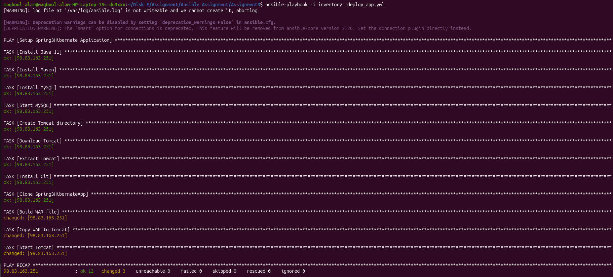
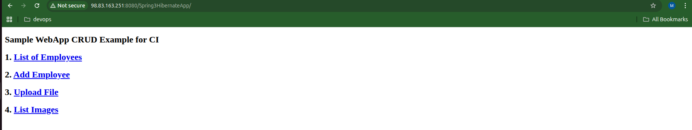

Spring3HibernateApp Deployment using Ansible

### project Architecture

Local Machine (Ansible)
        |
        | SSH
        ▼
AWS EC2 Instance (Ubuntu)
 ├── JDK 11
 ├── Maven
 ├── MySQL
 ├── Tomcat
 └── Spring3HibernateApp.war

Steps:
Deploy application:
   ansible-playbook -i inventory deploy_app.yml

Access:
http://<EC2_PUBLIC_IP>:8080/spring3hibernate

