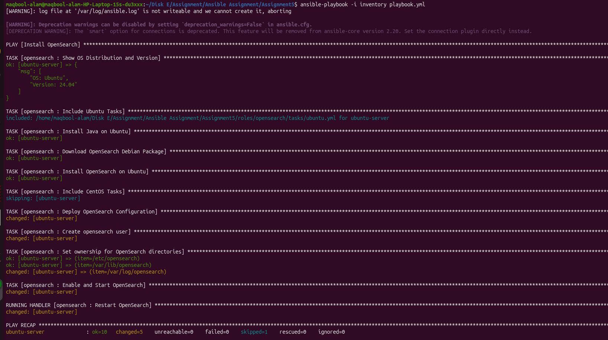

# Ansible Assignment-5: OpenSearch Role

## Features
- Version specific OpenSearch installation
- OS independent (Ubuntu & CentOS)
- Variablelized configuration
- Jinja2 template support
- Handlers separated from tasks
- User can execute role on Ubuntu, CentOS, or both
- OS version detection

---

## Project Structure

```bash
ansible-assignment/
├── inventory
├── playbook.yml
├── roles/
│   └── opensearch/
│       ├── tasks/
│       ├── handlers/
│       ├── templates/
│       ├── vars/
│       ├── defaults/
│       └── meta/
```

---

## Run Playbook

### Run on Ubuntu

```bash
ansible-playbook -i inventory playbook.yml --limit ubuntu
```

### Run on CentOS

```bash
ansible-playbook -i inventory playbook.yml --limit centos
```

### Run on Both

```bash
ansible-playbook -i inventory playbook.yml
```

---

## Variables

Edit:

```bash
roles/opensearch/defaults/main.yml
```

Example:

```yaml
opensearch_version: "2.11.0"
cluster_name: "demo-cluster"
```

---

## Template

Configuration file template:

```bash
roles/opensearch/templates/opensearch.yml.j2
```

---

## Handler

Handler location:

```bash
roles/opensearch/handlers/main.yml
```

---

## OS Version Check

The role automatically displays:

- OS Name
- OS Version

using Ansible facts.

---

## 📸 Results / Screenshots


