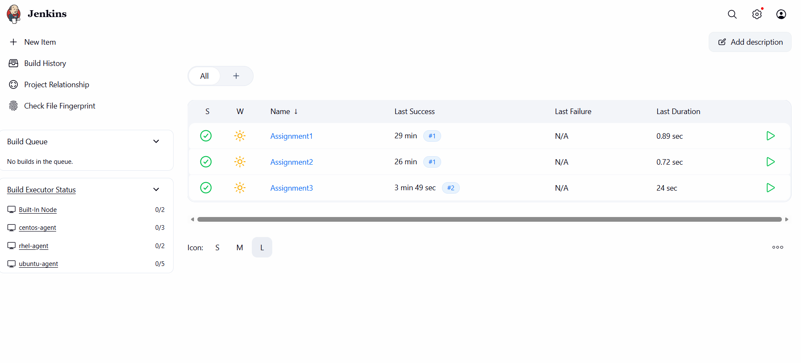
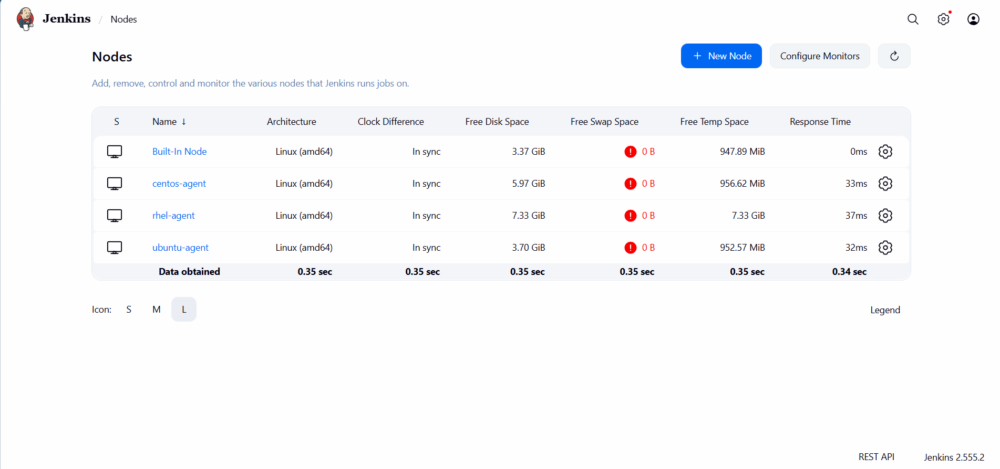
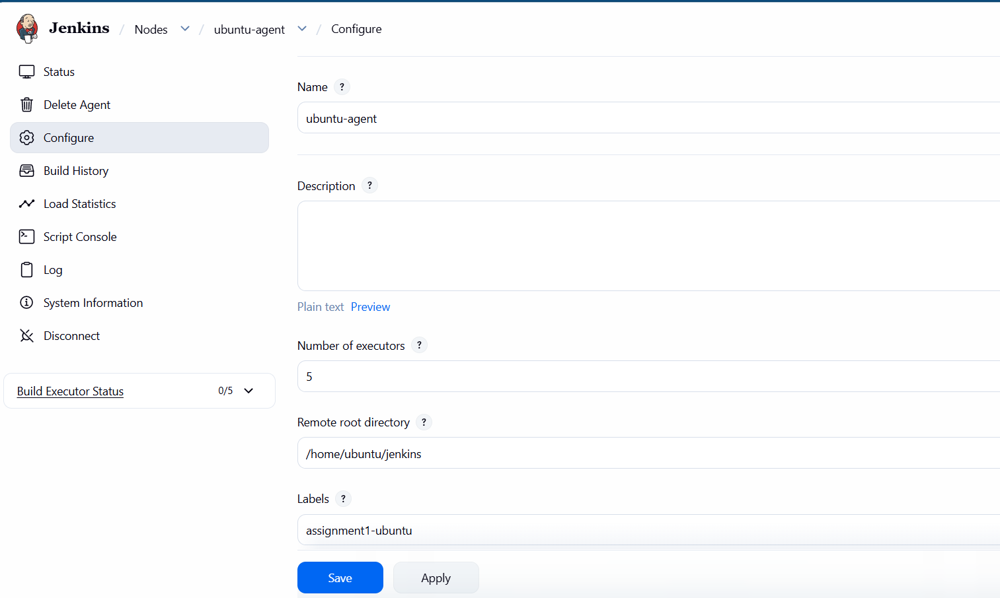
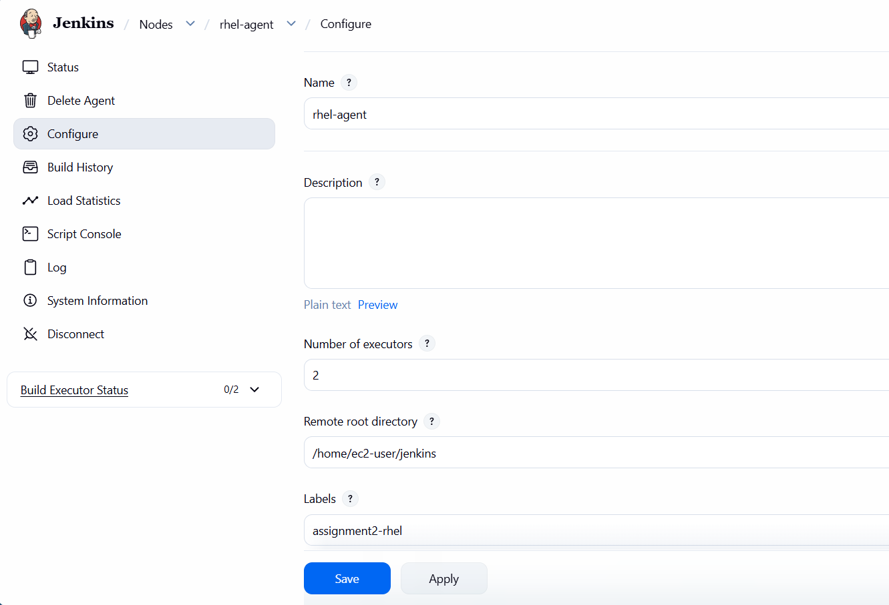
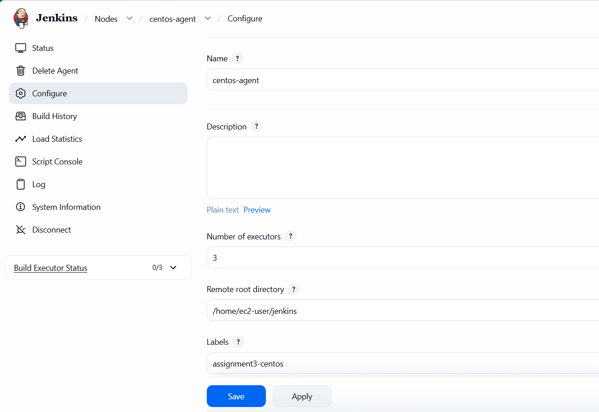
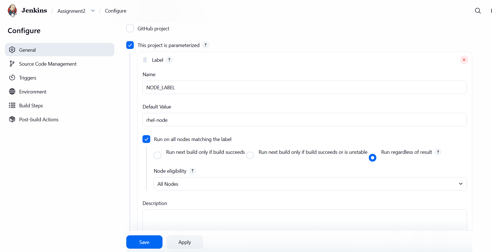
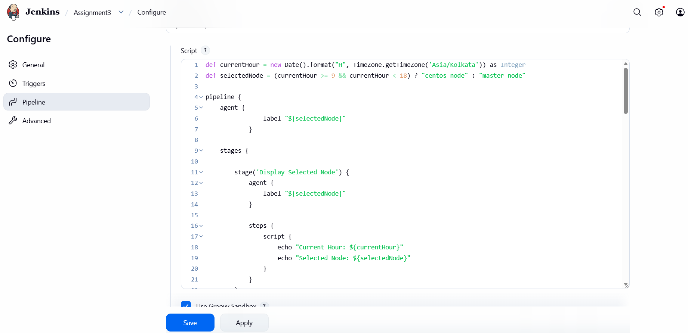
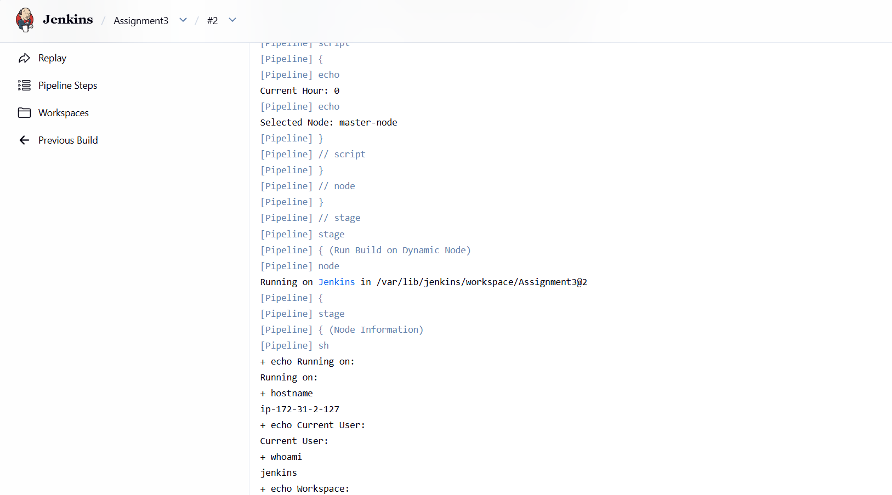

# JENKINS ASSIGNMENT-4  Node Configuration and Job Routing

This assignment demonstrates Jenkins agent/node configuration, executor limits, node assignment, and time-based job routing. The goal is to configure three slave nodes for Ubuntu, RHEL, and CentOS, then route builds to the new nodes during business hours and to the master outside that window.

---

## Topics Covered
- Configuring Agents
- Distributing Loads
- Executors
- Assigning Nodes
- Time-based node selection

---

## Node Configuration Summary

### Ubuntu Node
- Connection type: `Execute command on the master`
- Label: `Assignment 1: Part1`
- Executors: `5`
- Usage: `Only build jobs with matching label`
- Scheduling: used during business hours for Assignment 1 tasks

### RHEL Node
- Connection type: `Launch slave agents via SSH`
- Label: `Assignment 2: Part2`
- Executors: `2`
- Usage: `Only build jobs with matching label`
- Scheduling: used during business hours for Assignment 2 tasks

### CentOS Node
- Connection type: `Launch slave agents via SSH`
- Label: `Assignment 3`
- Executors: `3`
- Usage: `Only build jobs with matching label`
- Scheduling: used during business hours for Assignment 3 tasks

---

## Usage Instructions
1. Add the three nodes to Jenkins with the correct connection mechanisms.
2. Set the executor count for each node: Ubuntu=5, RHEL=2, CentOS=3.
3. Assign the appropriate node labels:
   - `Assignment 1: Part1`
   - `Assignment 2: Part2`
   - `Assignment 3`
4. Configure your Jenkins jobs to target the appropriate label.
5. Add time-based selection logic so jobs use the new nodes between `09:00` and `18:00`, otherwise run on `master`.

---

## Screenshots

### Jenkins Dashboard

### Nodes Overview

### Ubuntu Node Configuration

### RHEL Node Configuration

### CentOS Node Configuration

### Job Configuration with Node Labels

### Time-Based Routing Logic

