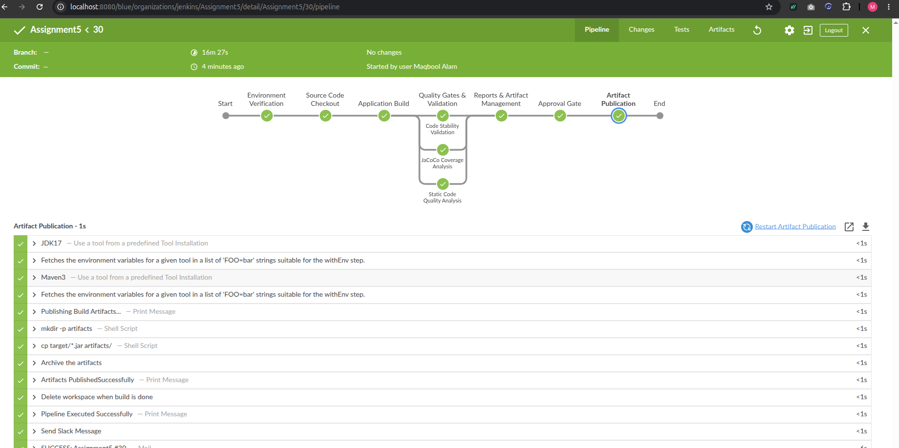
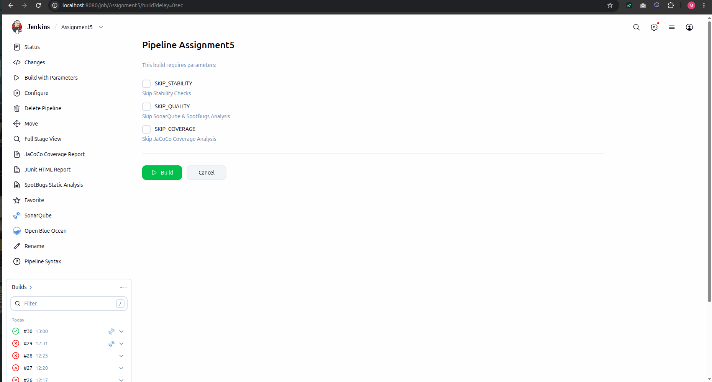
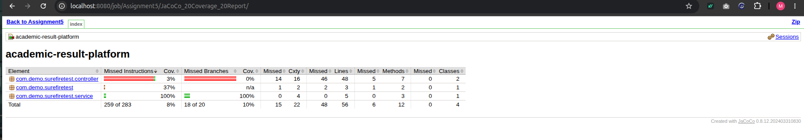
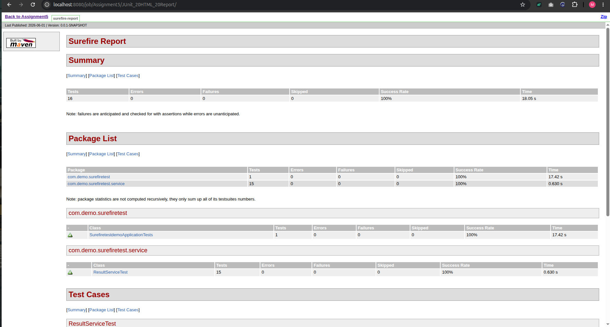
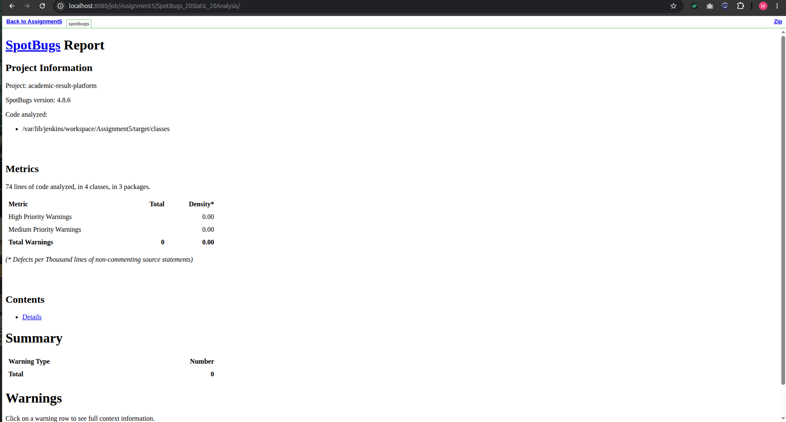
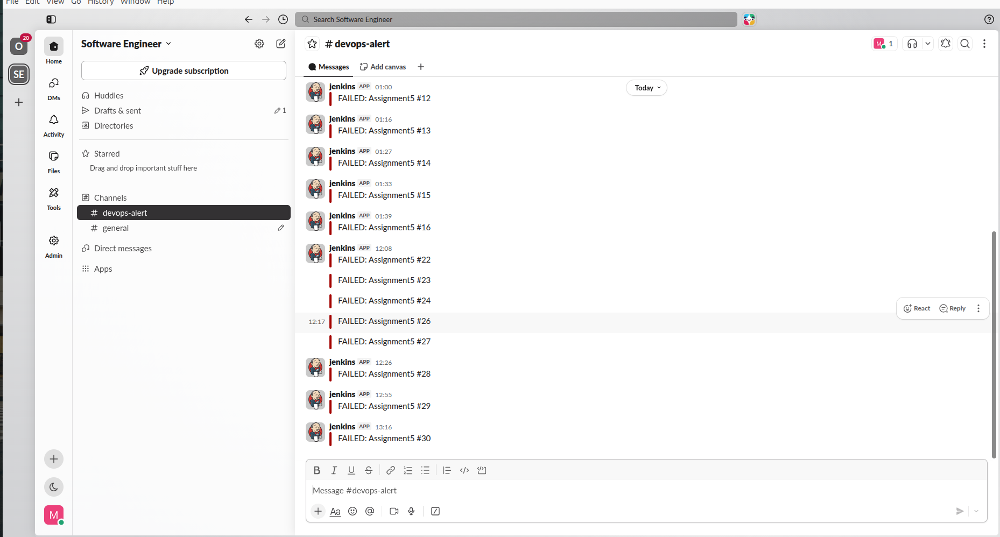
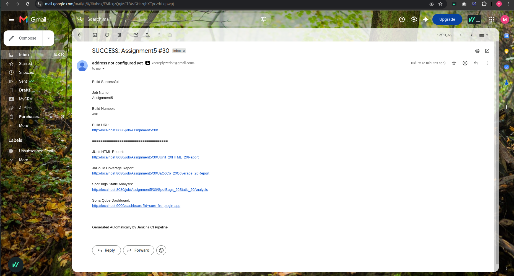
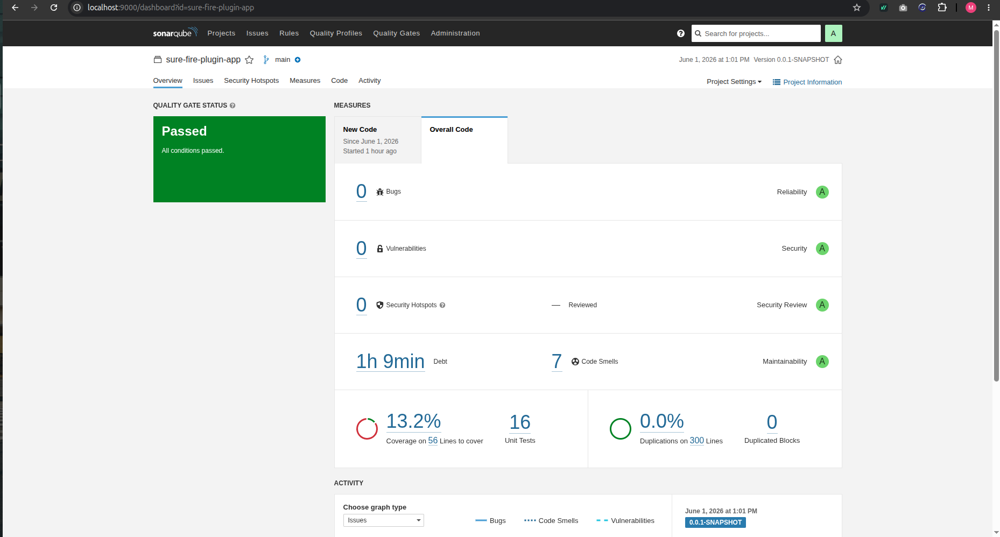
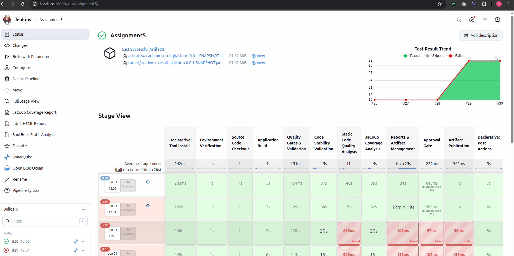

# JENKINS ASSIGNMENT-5  Java Declarative CI Pipeline

This assignment implements a Declarative Jenkins pipeline for a Java project. It includes code checkout, parallel scans for stability, quality, and coverage, report publishing, artifact archiving, approval gating, and Slack + email notifications.

---

### Prerequisites
- Jenkins instance with Git, Pipeline, Email Extension, Slack Notification, HTML Publisher, and Static Analysis plugins installed.
- Configured JDK 11 and Maven toolchains in Jenkins.
- SonarQube server configured as `sonarqube` in Jenkins.
- Slack workspace and channel webhook configured in the Jenkins global configuration.
- SMTP settings configured for email notifications.

### Pipeline Features
- Declarative pipeline defined in `Jenkinsfile`
- `Code Checkout` stage to clone the Java repository
- `Parallel Scans` consisting of:
  - Code Stability Analysis (JUnit)
  - Code Quality Analysis (SonarQube & SpotBugs)
  - Code Coverage Analysis (JaCoCo)
- Conditional scan execution via build parameters
- `Package Artifact` stage with archived WAR artifact
- `Approval Before Publish` stage to manually approve or deny publishing
- `Publish Artifact` stage after approval
- Post-build Slack and email notifications for success, failure, and abort

### Build Parameters
- `SKIP_STABILITY`: Skip Unit Tests
- `SKIP_QUALITY`: Skip SonarQube & SpotBugs
- `SKIP_COVERAGE`: Skip JaCoCo Analysis

### Implementation Notes
1. Jenkins is configured to use `jdk 'java11'` and `maven 'maven'`.
2. The repository is checked out from GitHub using the `master` branch.
3. Parallel stages improve CI throughput by executing stability, quality, and coverage checks concurrently.
4. Scan stages are skipped when corresponding boolean parameters are enabled.
5. Checkstyle results are recorded using Jenkins issue tracking.
6. JaCoCo publishes an HTML coverage report.
7. The artifact is archived from `target/*.war` and copied to a `published/` folder after approval.
8. Notifications are sent to Slack channel `#devops-alert` and email address `12mrmack@gmail.com`.

---

## Screenshots

### Success Job

### Build execution and parameter controls

### Parallel quality scan stages

### Notifications

---

## Usage
1. Create a new Jenkins Pipeline job.
2. Point the job to this repository.
3. Ensure the Jenkinsfile is selected as the pipeline script source.
4. Configure the required tools and environment variables.
5. Run the job and approve publication when prompted.

---

## Notes
- This repository contains the Declarative Pipeline solution in `Jenkinsfile`.
- The pipeline provides flexible scan skipping and manual publication control for a production-style Java CI workflow.
