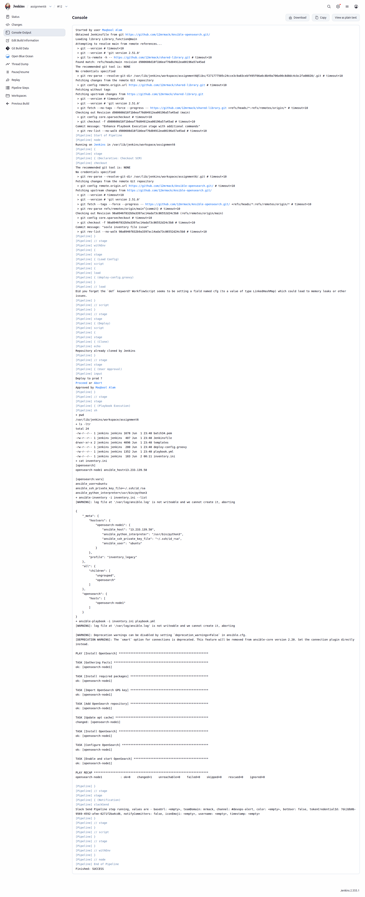
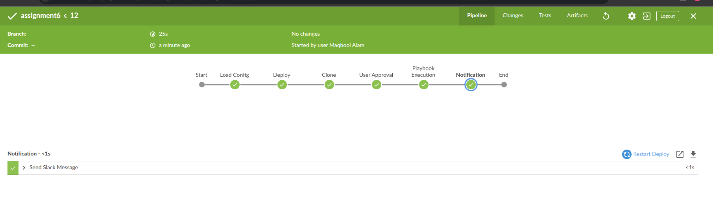
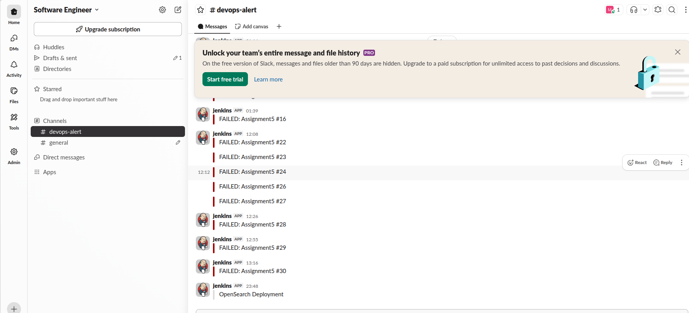
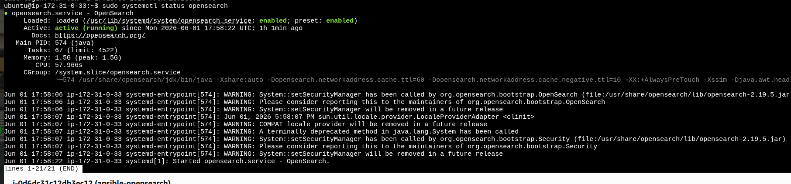

# Jenkins Assignment 6: Ansible Shared Library for Jenkins

This repository implements a Jenkins shared library for Ansible-based automation in Jenkins freestyle jobs. The library is designed to drive a reusable Jenkins pipeline with the following stages:

- `Clone`: checkout the target repository or codebase
- `User Approval`: require human approval before execution proceeds
- `Playbook Execution`: run the Ansible playbook against the configured environment
- `Notification`: send build status messages to the target channel or notification system

The shared library accepts required inputs from a configuration file and supports flexible reuse across environments.

## Jenkins Shared Library Flow

1. **Clone**
   - The pipeline clones the repository and loads the configuration file.
2. **User Approval**
   - The pipeline waits for an approval step when enabled by `KEEP_APPROVAL_STAGE=true`.
3. **Playbook Execution**
   - The configured Ansible playbook is launched against the target inventory.
4. **Notification**
   - A notification is sent after execution using the configured channel and message.

## Prerequisites

- Jenkins installed with Git support
- Configured Ansible execution environment on Jenkins agents
- Slack notification integration or other webhook notification mechanism
- SSH access / credentials for target hosts
- The required `SLACK_CHANNEL_NAME`, `ENVIRONMENT`, `CODE_BASE_PATH`, `ACTION_MESSAGE`, and `KEEP_APPROVAL_STAGE` values configured in the library input

## Usage

1. Configure the Jenkins shared library in the Jenkins global configuration.
2. Add the repository containing `Jenkinsfile` and shared library metadata.
3. Create or update the config file with the required variables.
4. Run the Jenkins job and verify the stages:
   - Clone
   - User Approval
   - Playbook Execution
   - Notification

## Screenshots

### Shared library repository view

https://github.com/12mrmack/shared-library

### Jenkins build

### Job success

### Slack notification

### Tool running on ec2

