# Assignment 02 - AWS Deployment Strategies with Amazon S3

## Objective
Learn and implement multiple deployment strategies on AWS while integrating Amazon S3 for static assets, deployment artifacts, configuration files, and logs.

# 1. Recreate Deployment

## Overview
The existing application is terminated and replaced with a new version.

## Implementation Steps

1. Launch an EC2 instance.
2. Deploy Spring application V1.
3. Store static assets in S3.
4. Create an AMI snapshot.
5. Deploy V2 and create a new AMI.
6. Terminate old EC2.
7. Launch a new EC2 using the V2 AMI.

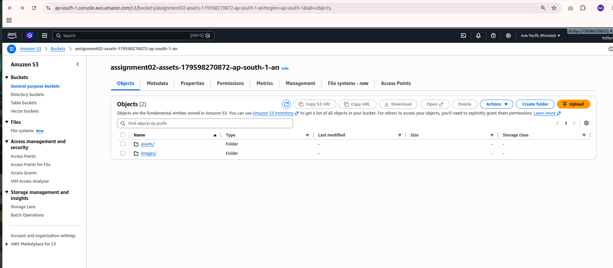
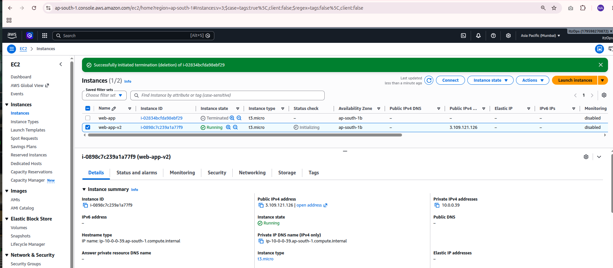
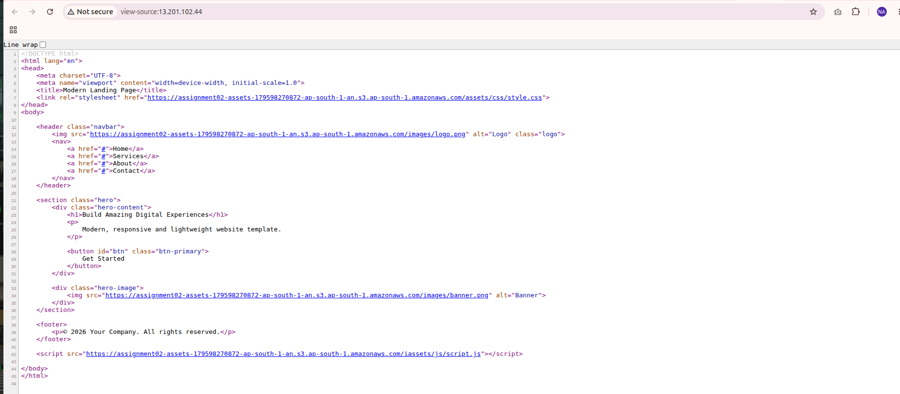
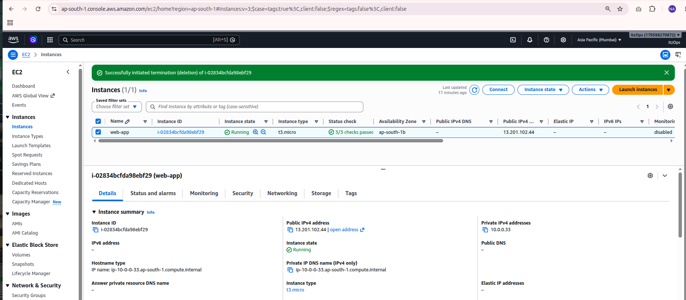
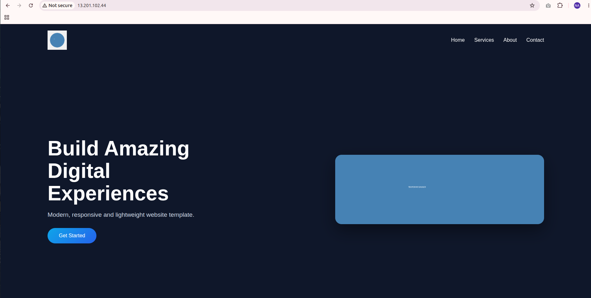
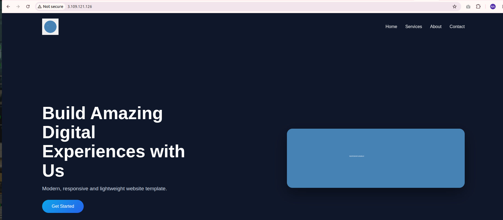
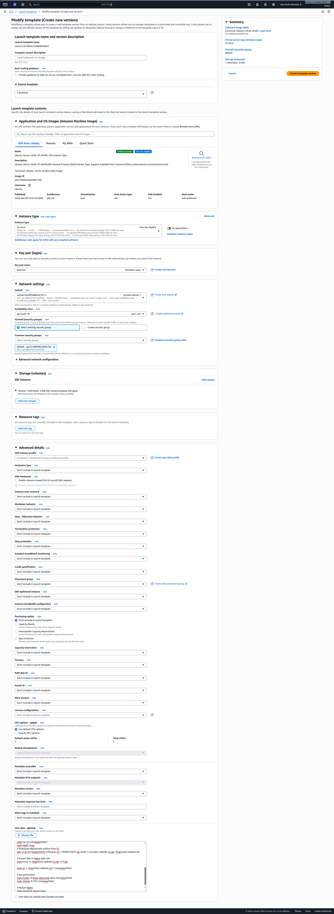

## Advantages
- Simple implementation
- Easy to understand

## Disadvantages
- Downtime during deployment

---

# 2. Rolling Deployment

## Overview
Instances are updated gradually without taking down the entire application.

## Implementation Steps

1. Create Launch Template V1.
2. Create Auto Scaling Group.
3. Deploy application V1.
4. Store deployment artifacts in S3.
5. Create Launch Template V2.
6. Update ASG.
7. Perform Instance Refresh.


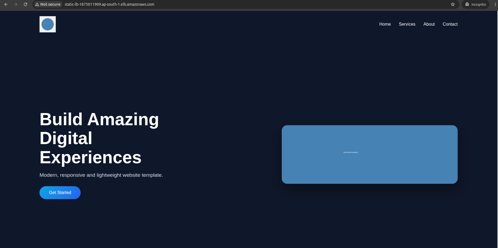
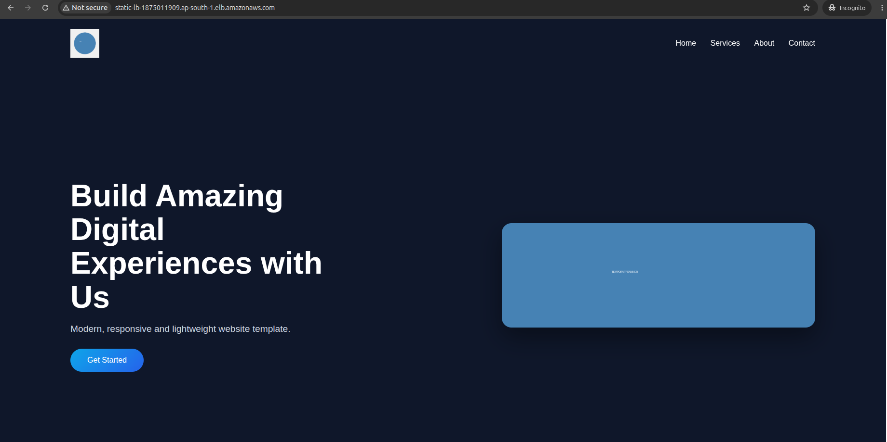
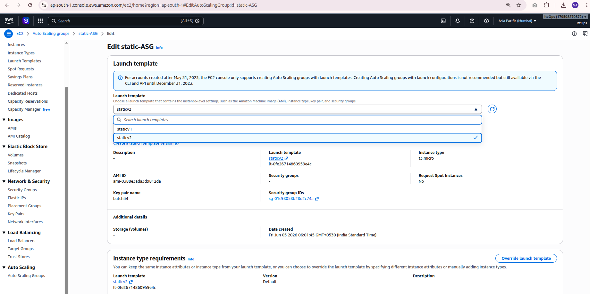
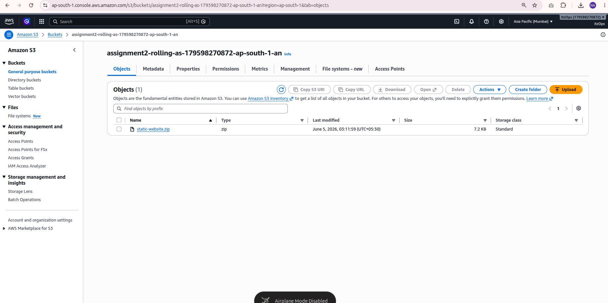
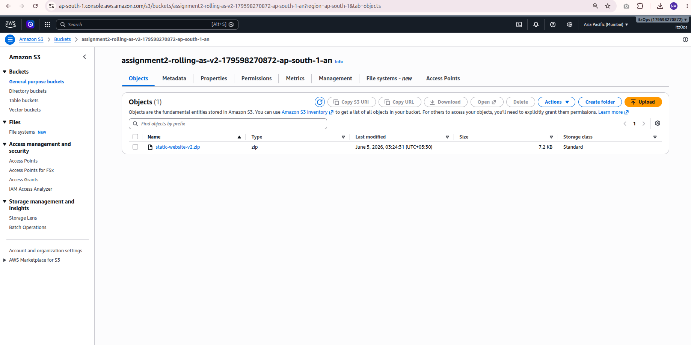


## Advantages
- No downtime
- Suitable for production

## Disadvantages
- Slower rollout

---

# 3. Blue-Green Deployment

## Overview
Maintain two identical environments.

- Blue = Current Production
- Green = New Version

## Implementation Steps

1. Create Blue environment.
2. Create Green environment.
3. Deploy new version to Green.
4. Validate application.
5. Switch ALB traffic to Green.

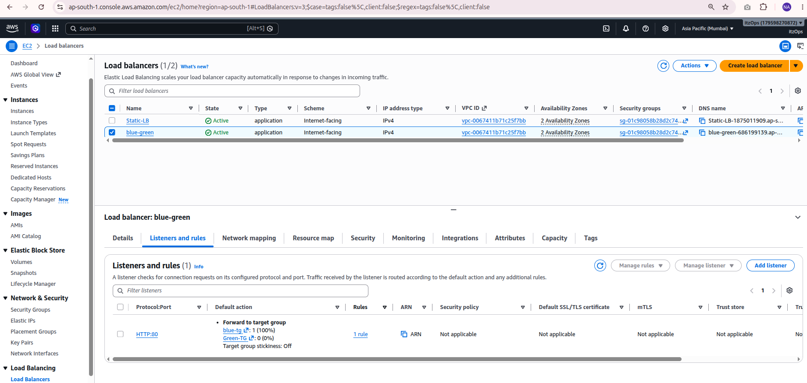
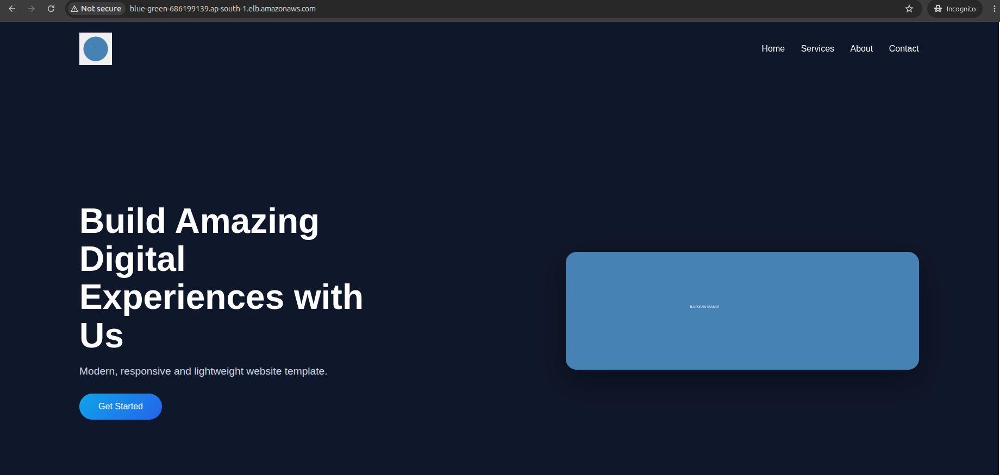
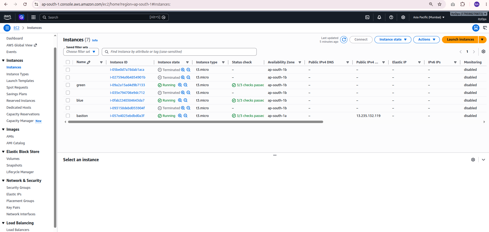
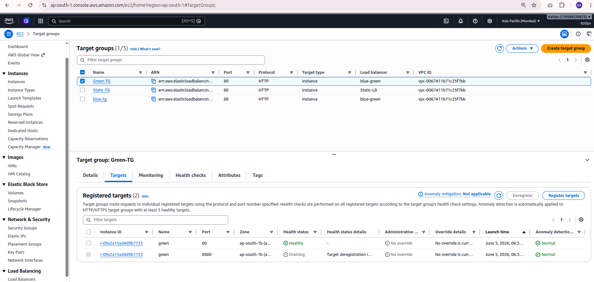
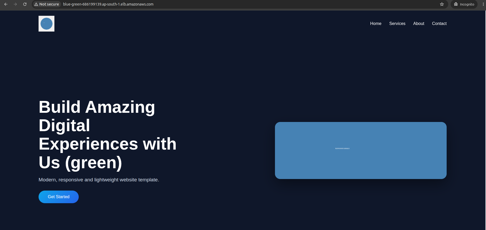


## S3 Usage

Store environment-specific configuration files:

```text
configs/blue/
configs/green/
```

## Advantages
- Zero downtime
- Fast rollback

## Disadvantages
- Higher infrastructure cost

---

# 4. Canary Deployment

## Overview
Release new application version to a small percentage of users first.

## Example

```text
90% -> Version 1
10% -> Version 2
```

## Implementation Steps

1. Create Target Group V1.
2. Create Target Group V2.
3. Configure weighted routing on ALB.
4. Send small traffic to V2.
5. Monitor logs and metrics.
6. Increase traffic gradually.


we change into forword target group into 90% green and 10% blue so this will work as canary depoyment


## S3 Usage

Store logs and metrics:

```text
logs/canary/
```

## Advantages
- Low deployment risk
- Real user validation

## Disadvantages
- Requires monitoring

---

# 5. A/B Deployment

## Overview
Users are routed to different application versions based on attributes.

Examples:
- Location-based routing
- Premium vs Standard users
- Cookie-based routing


we change into forword target group into 90% green and 10% blue so this will work as A/B depoyment

## Advantages
- User behavior testing
- Feature validation

---

# Comparison Table

| Strategy | Downtime | Rollback | Cost |
|-----------|-----------|-----------|------|
| Recreate | Yes | Slow | Low |
| Rolling | No | Medium | Low |
| Blue-Green | No | Very Fast | High |
| Canary | No | Fast | Medium |
| A/B | No | Fast | Medium |

---
