## Project Architecture Overview
This repository contains documentation, setup guides, scripts, and configuration blueprints for resolving our client's infrastructure scaling challenges. We design and implement a highly available (HA) and disaster recovery (DR) capable **Nginx Middleware / Reverse Proxy** tier between clients and application services over the AWS Cloud.

The architecture covers horizontal scaling, image management, self-healing setups, path-based Application Load Balancer routing, IAM security policies, and CDN integration.

## Day-by-Day Implementation Playbook

### Day 1: Middleware Initialization, Golden AMIs & ASG Stress Policy Mapping

#### 1. Baseline Baking Matrix (Manual Phase)
* **Baking Nginx Version 1 (V1 - Stable Baseline):**
  Launch a base EC2 instance (`Ubuntu 22.04 LTS` or `Amazon Linux 2`). Connect and install Nginx:

  ```
  sudo apt update && sudo apt install nginx -y
  ```

  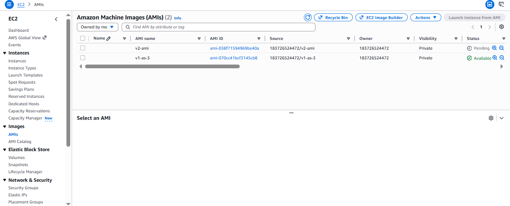

  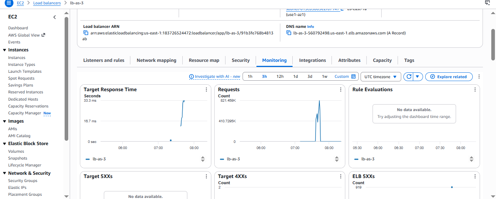

  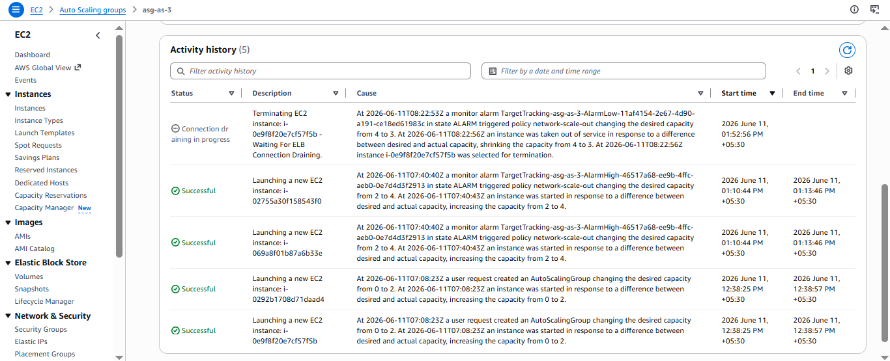

  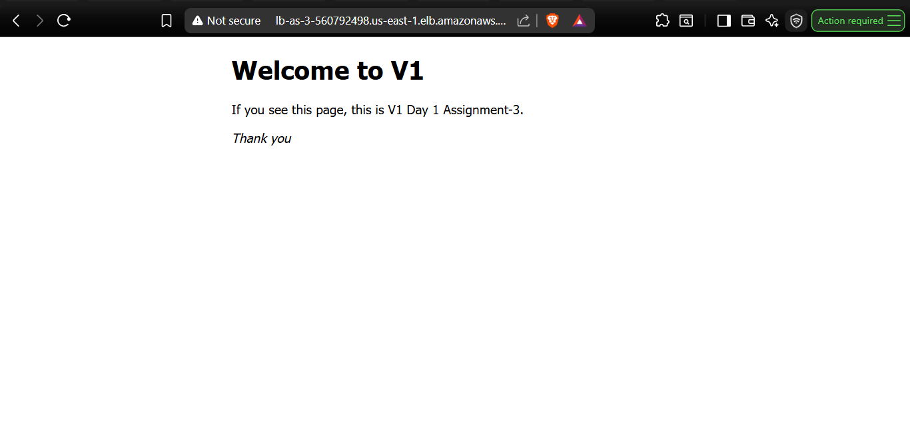

  

  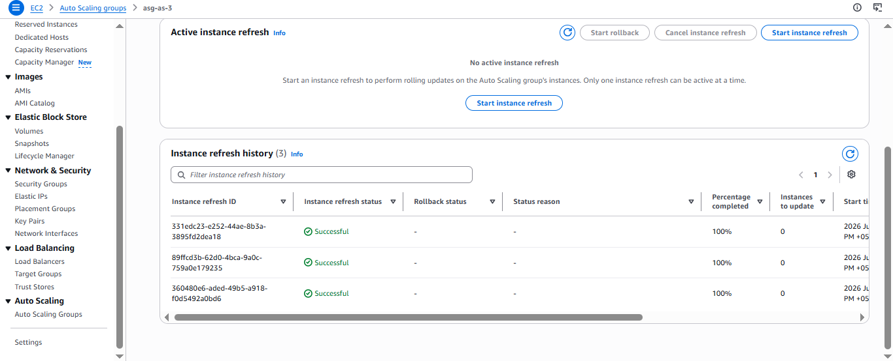

### Day 2: Decoupled Web-Hosting Assets via AWS S3 Storage Pipelines

The middleware framework maps requests out to high-durability object storage blocks to preserve statelessness.

#### 1. Zero-Credential Security (IAM Instance Profile)
We avoided storing hardcoded access keys on the machines. Instead, an **IAM Instance Profile Role** was assigned directly to the EC2 instances. This grants the proxy nodes structural permissions to call AWS CLI sync utilities securely.

#### 2. VCS Repository to S3 Synchronization
From the EC2 build workspace, the required user assets were cloned out of Git and synchronized directly to our S3 storage bucket using the AWS CLI:

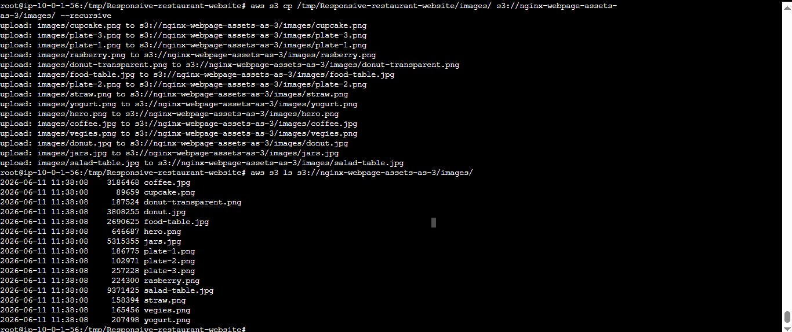

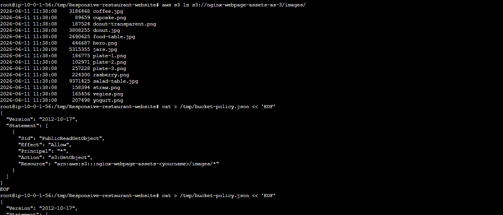

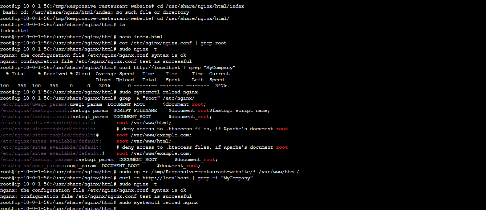

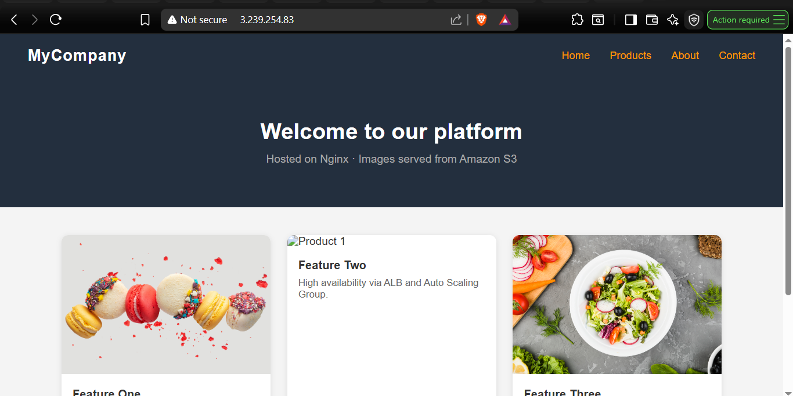

### Day 3: Self-Healing Resilience Validation
To verify the self-healing capability of the Auto Scaling Group when infrastructure nodes encounter an unrecoverable failure:

#### Induced Failure
Stopped the backend engine on an active instance: **sudo systemctl stop nginx**

#### Observations
The ALB target group health check quickly registered a port 80 timeout and marked the host as Unhealthy. Traffic was immediately rerouted away from the broken server. The ASG then terminated the faulty node and spun up a healthy instance automatically to maintain the fleet's desired size.

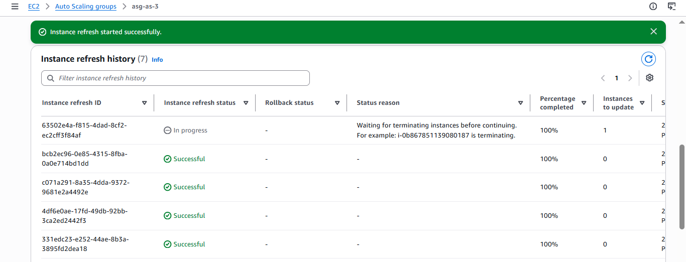

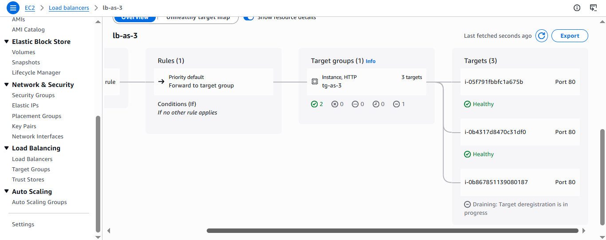

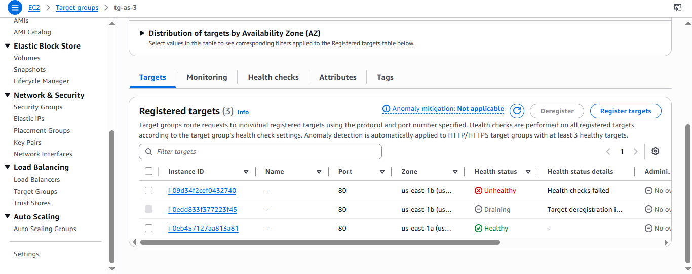

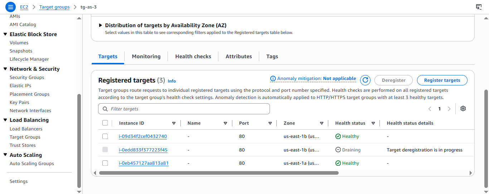

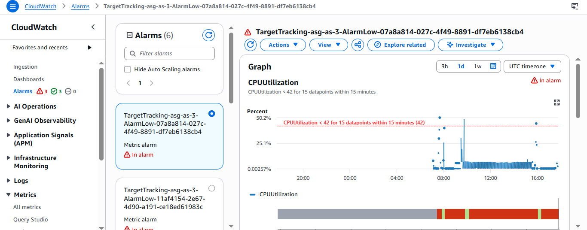

### Day 4: Hardened Subnets & Path-Based ALB Routing
To minimize attack vectors, compute nodes are placed in private network zones.

#### 1. Network Security Matrix
Bastion Host (Public Subnet): Inbound Port 22 (SSH) open only to YOUR_OWN_PUBLIC_IP/32.

Application Load Balancer (Public Subnet): Inbound Port 80 (HTTP) open only to YOUR_OWN_PUBLIC_IP/32.

Nginx Middleware Nodes (Private Subnets): Inbound Port 22 open only to the Bastion Security Group. Inbound Port 80 open only to the ALB Security Group.

#### 2. ALB Path Rules Mapping
Target Group 1 (tg-ninja1): Directs requests containing the path query /ninja1 to the first EC2 node, displaying Image-1.

Target Group 2 (tg-ninja2): Directs requests containing the path query /ninja2 to the second EC2 node, displaying Image-2.

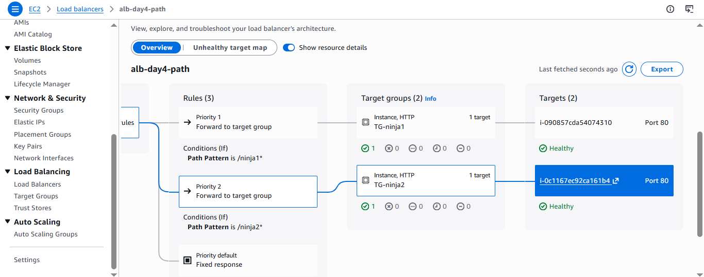

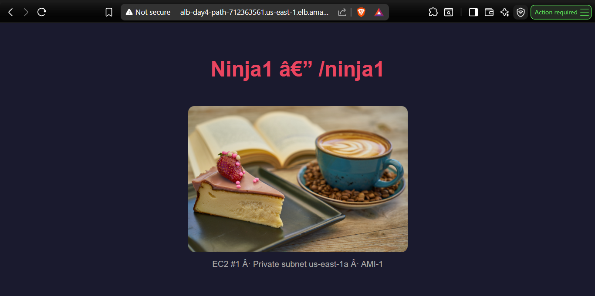

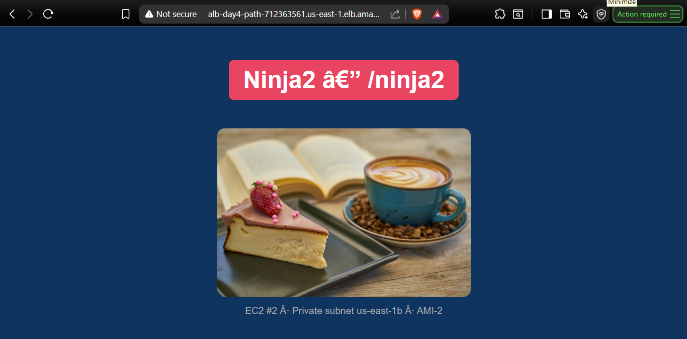

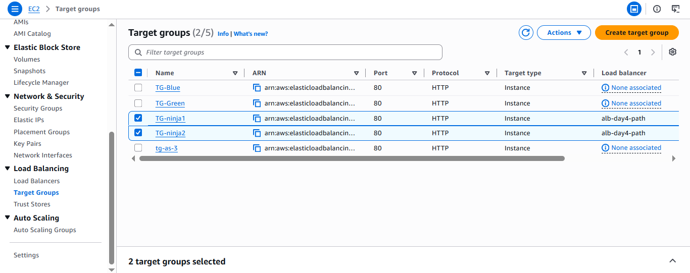

### Day 5: Granular Environment Isolation and IAM S3 Bucket Policies
The corporate landscape requires a clear data boundary inside the us-east-1 storage container to prevent cross-contamination between folders.

#### Folder Architecture Mapping 
Split into s3://client-assets-day-5-maqbool/prod/ and s3://client-assets-day-5-maqbool/nonprod/.

#### Applied Safeguards
Configured strict boundaries using a combination of IAM User Restriction Policies and an S3 Bucket Access Control Document. The design blocks the restricted IAM User from accessing /prod while allowing full data management permissions in /nonprod. It also allows our EC2 application role context to communicate with both paths.

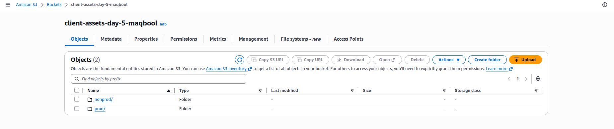

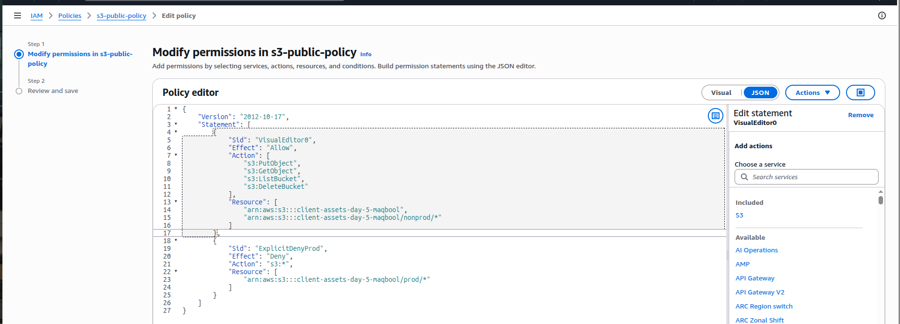

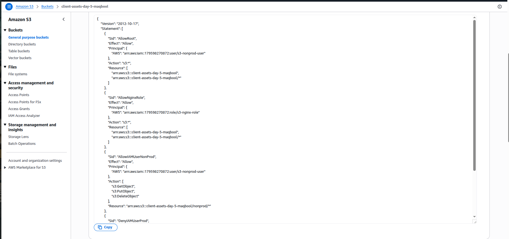

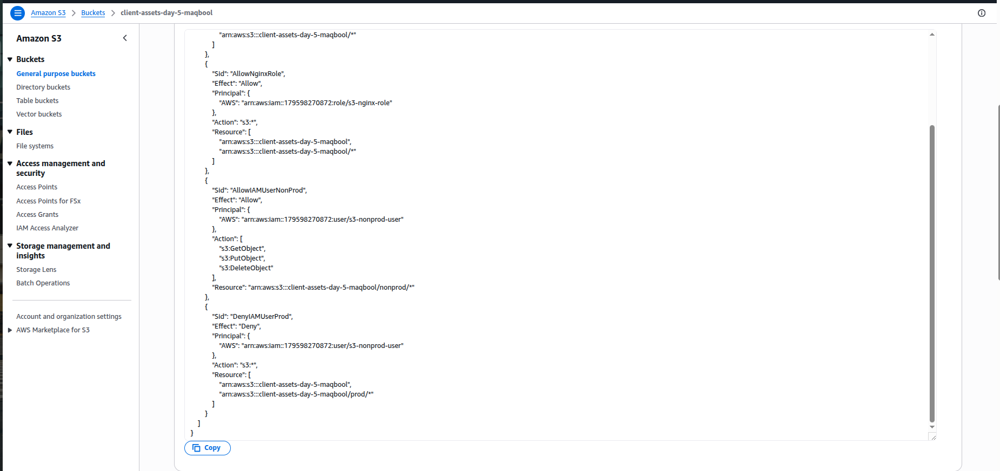