# Assignment 04 – Infrastructure Provisioning Using Terraform

## Objective

The objective of this assignment is to design and implement cloud infrastructure using **Terraform Infrastructure as Code (IaC)** based on a predefined architecture. The infrastructure follows Terraform best practices and uses **Amazon S3** for remote state management.

---

# Architecture Overview

The infrastructure consists of the following AWS resources:

- VPC
- Public Subnets
- Private Subnets
- Internet Gateway
- Route Tables
- Security Groups
- Jump Server (Bastion Host)
- Private EC2 Server
- Launch Template
- Auto Scaling Group (ASG)
- Application Load Balancer (ALB)
- OpenSearch Cluster
- OpenSearch Dashboard
- S3 Bucket for Terraform Backend

---

# Architecture Diagram

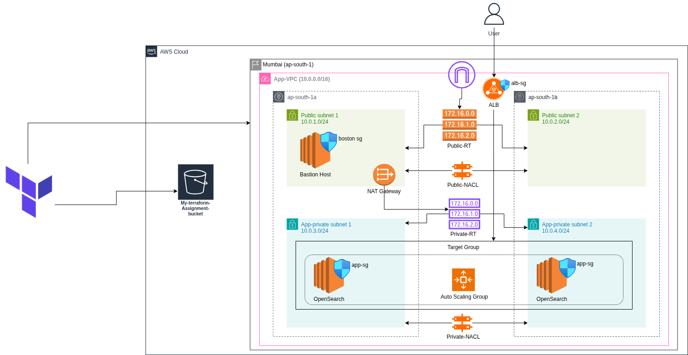

---

# Infrastructure Components

## Networking Layer

- VPC
- Public Subnets
- Private Subnets
- Internet Gateway
- Route Tables

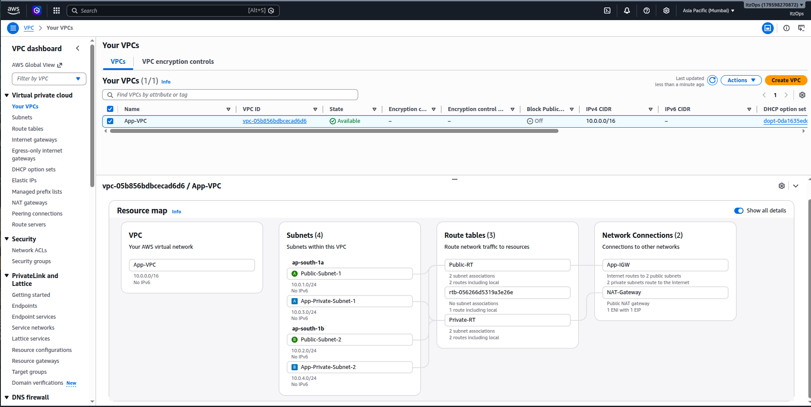

## Security Layer

- Jump Server Security Group
- Application Security Group

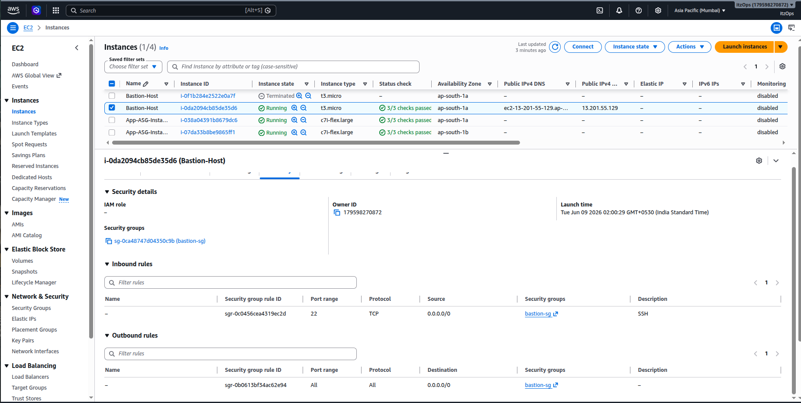
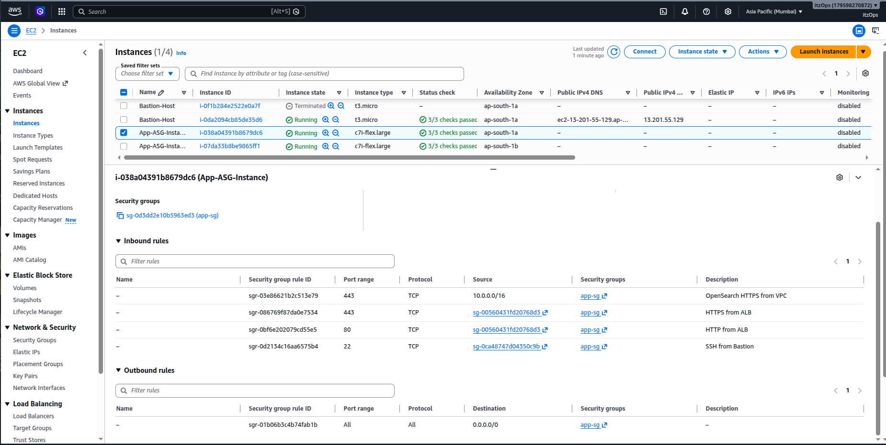

## Compute Layer

### Jump Server (Bastion Host)

- Public IP
- SSH Access using PEM Key

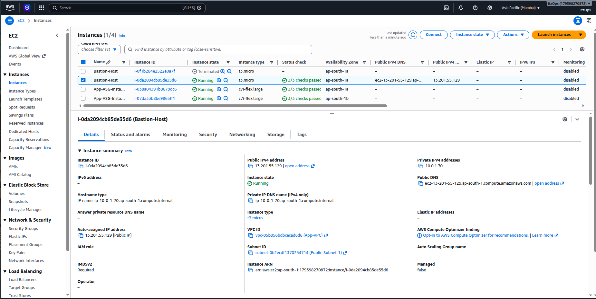

### Private EC2 Server

- No Public IP
- Accessible through Bastion Host

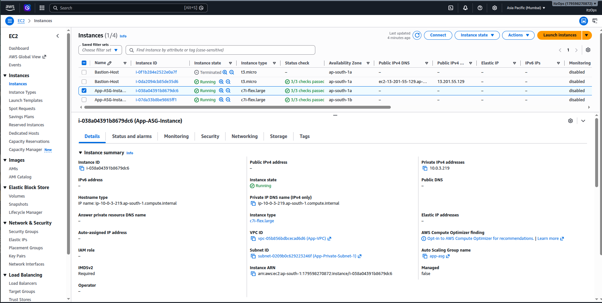

## Load Balancer Layer

### Application Load Balancer (ALB)

- Traffic Distribution
- Health Checks
- Target Groups

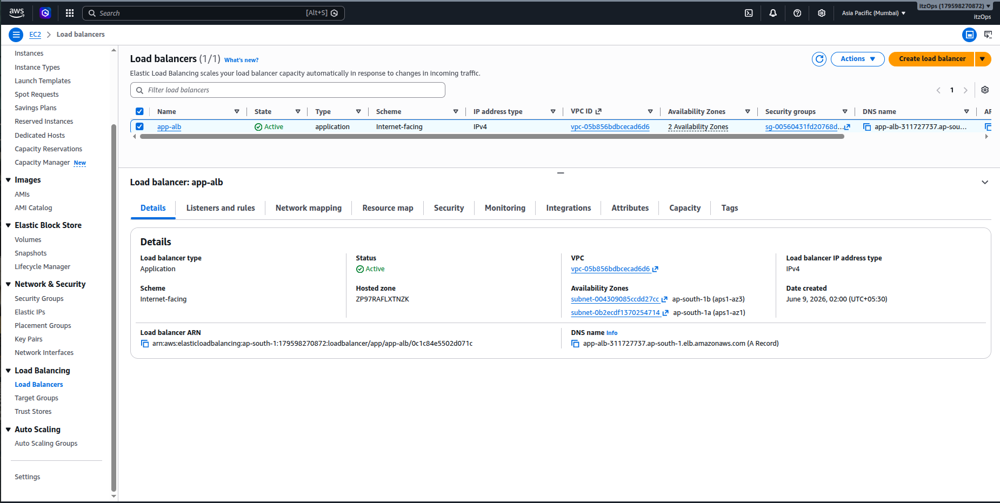

## Auto Scaling

### Launch Template

Defines:
- AMI
- Instance Type
- Security Groups
- User Data

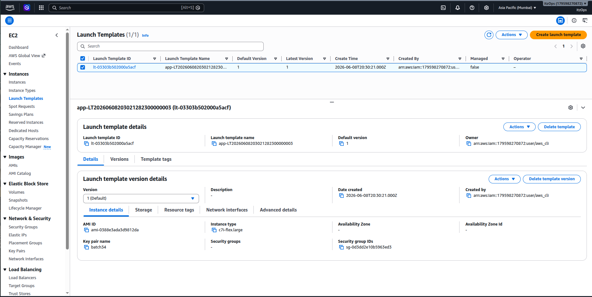

### Auto Scaling Group

- Automatic Scaling
- High Availability
- Integrated with ALB

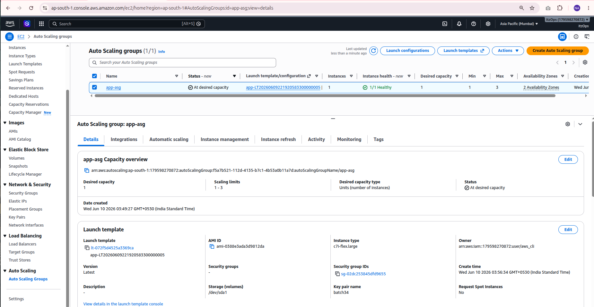
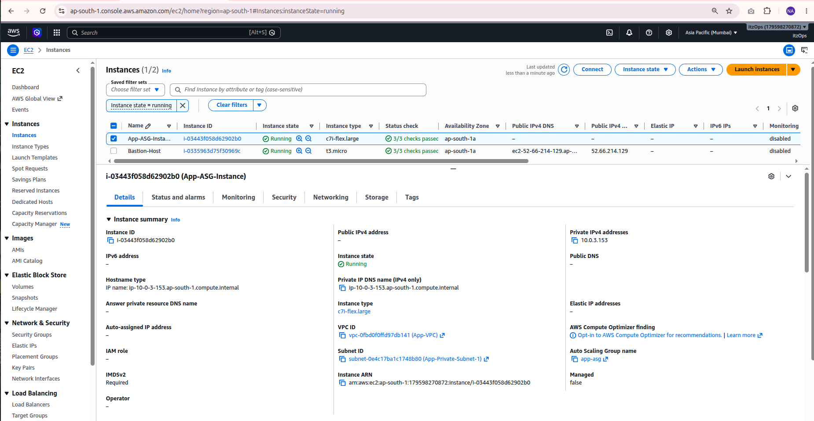

## OpenSearch Deployment

- OpenSearch Domain

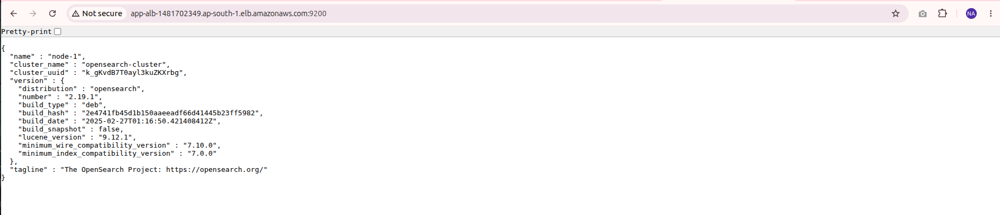

- OpenSearch Dashboard

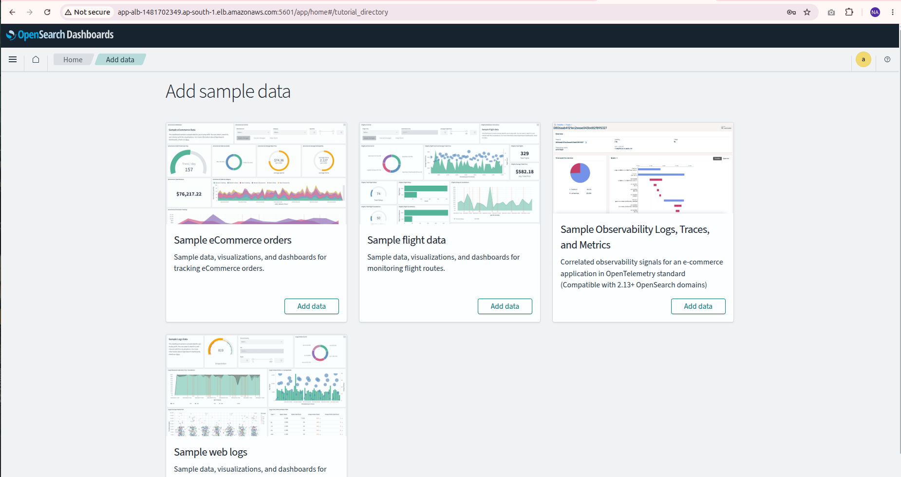
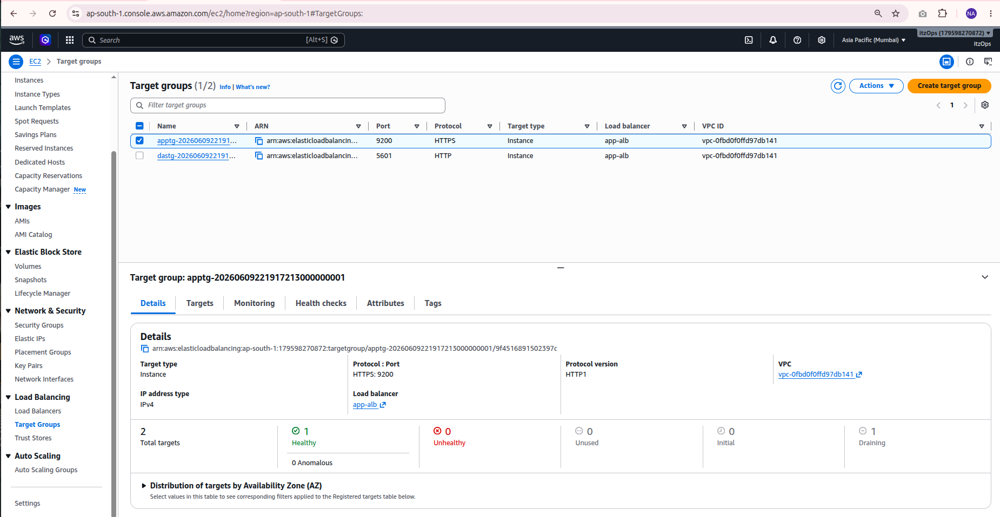

---

# Terraform Backend Configuration

## S3 Backend

Used for storing Terraform State remotely.
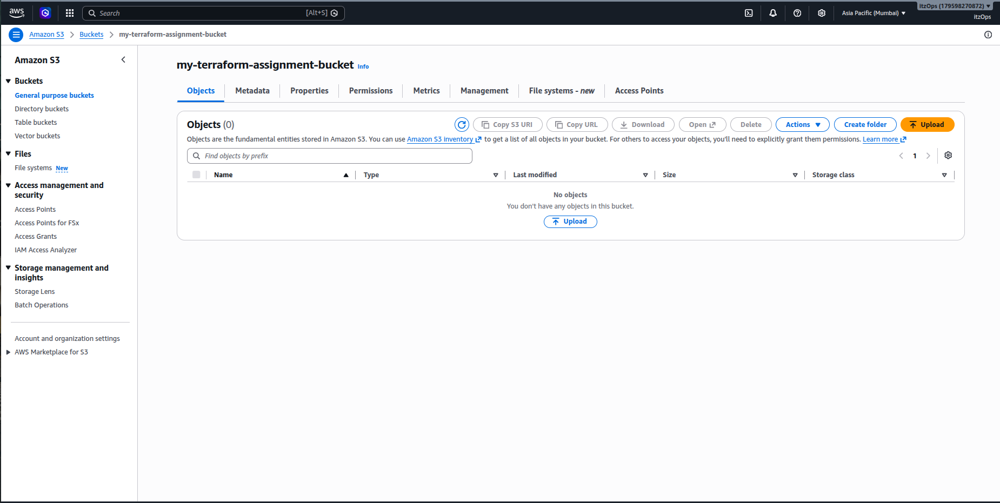

---

# Terraform

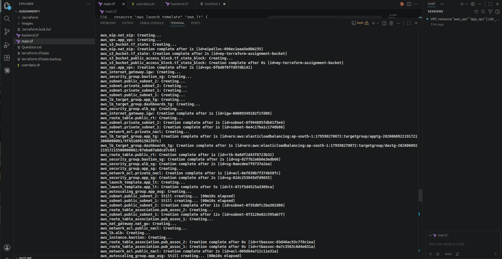
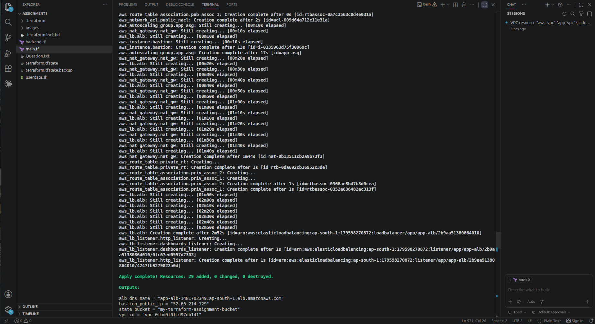

# Outcome

Successfully provisioned AWS infrastructure using Terraform including networking, compute resources, load balancing, auto scaling, OpenSearch, and remote state management with S3 and DynamoDB.
