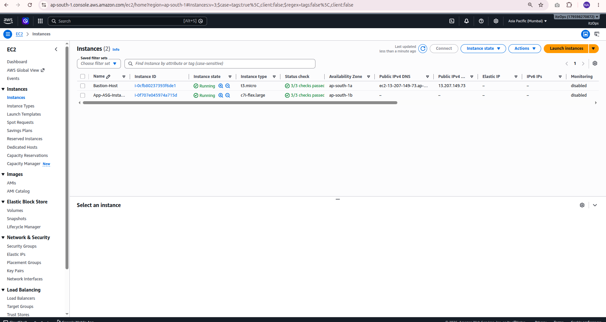
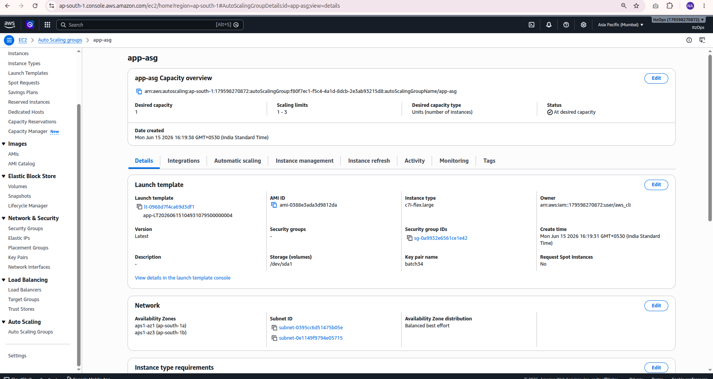
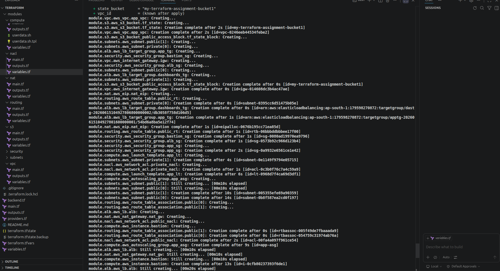
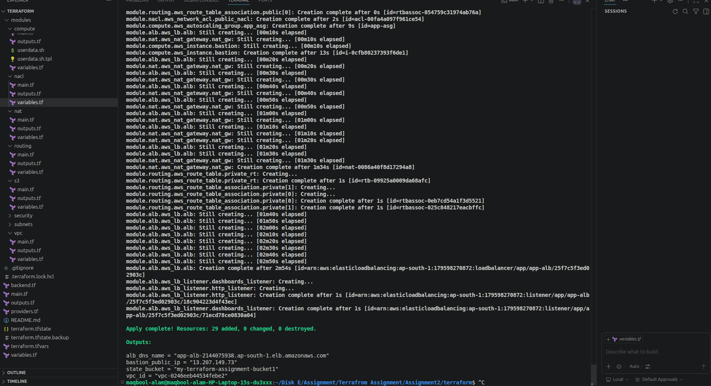

# Assignment 05 - Implement Infrastructure with Terraform Modules

## Objective
Implement AWS infrastructure using reusable Terraform modules and configure remote state management with Amazon S3 and DynamoDB state locking.


## Terraform State Management

- Remote State: Amazon S3
- State Locking: DynamoDB
- Versioning enabled on S3 bucket
- Prevents concurrent Terraform execution

---

## Architecture Screenshots

### VPC Map


### EC2 Instance


### Load Balancer


### Auto Scaling Group


### S3 Bucket


### Terraform State File Stored in S3


### OpenSearch Dashboard


### OpenSearch API


### Backend Lock Configuration


### Application Deployment




### Application Health Check


### Dashboard Health Check


---

## Deployment Commands

```bash
terraform init
terraform validate
terraform plan
terraform apply -auto-approve
```

---

## Deliverables

- Reusable Terraform Modules
- VPC, Subnets, Security Groups, EC2, ALB, ASG
- OpenSearch Deployment
- S3 Remote Backend
- DynamoDB State Locking
- Screenshots for verification
