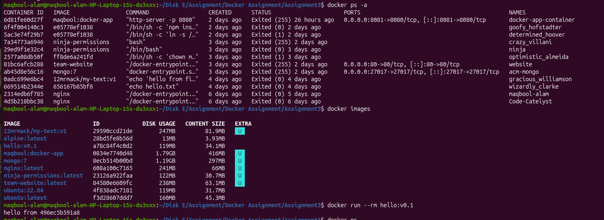

# Docker Assignment - Hello Hostname Application

## Overview

This project demonstrates how to create a Docker image using Alpine Linux and Node.js. The container executes a simple Node.js application that prints a greeting message along with the container hostname.

---

## Project Structure

```text
.
├── Dockerfile
├── index.js
└── README.md
```

## Application Code

### index.js

```javascript
var os = require("os");
var hostname = os.hostname();

console.log("hello from " + hostname);
```

## Dockerfile

```dockerfile
FROM alpine:latest

LABEL maintainer="Maqbool Alam"

RUN apk update && apk add --no-cache nodejs

COPY . /app

WORKDIR /app

CMD ["node", "index.js"]
```


