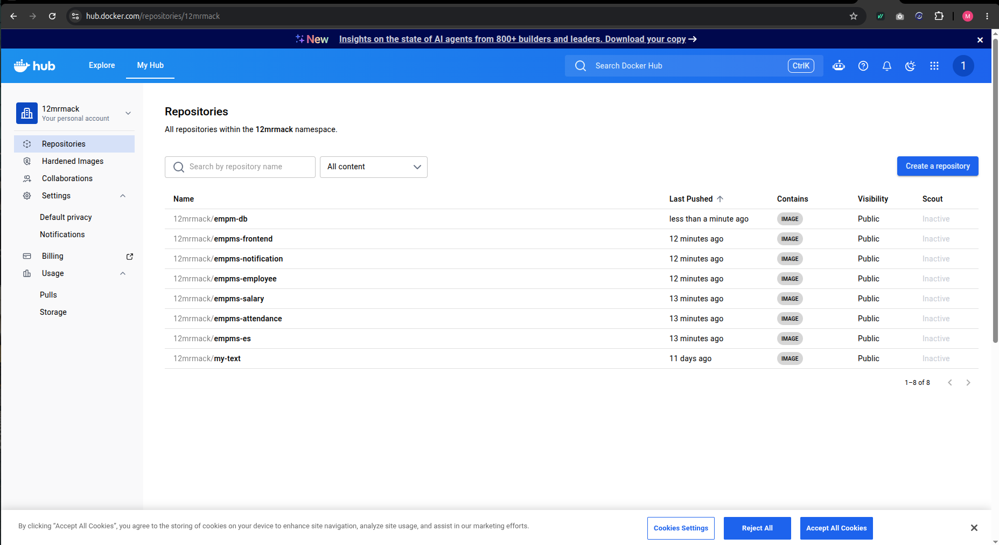
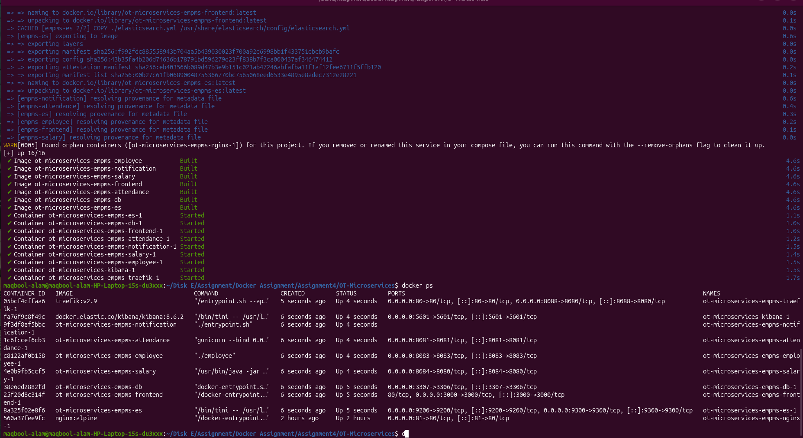
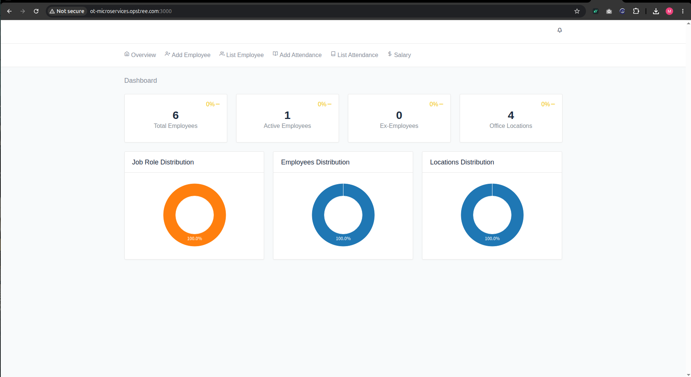
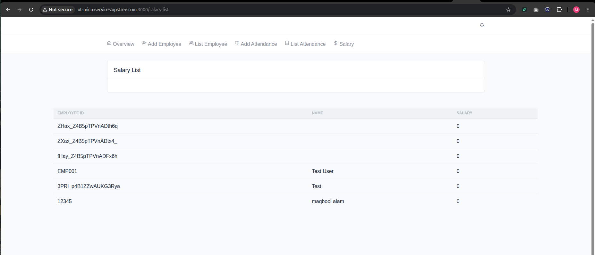
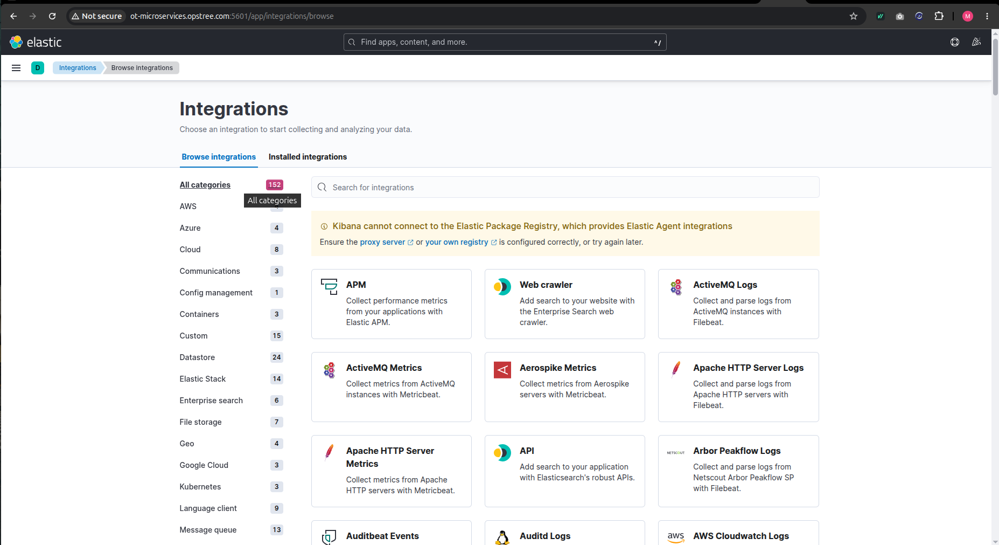
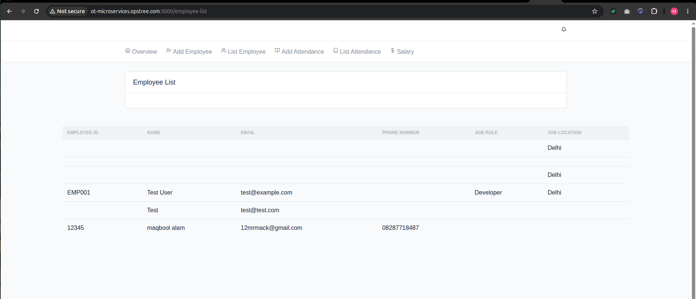
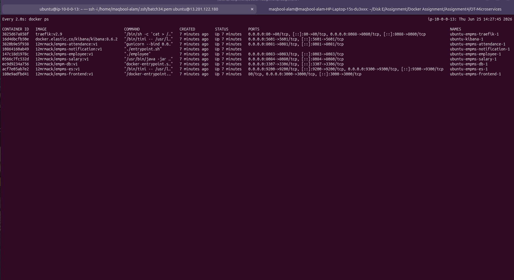
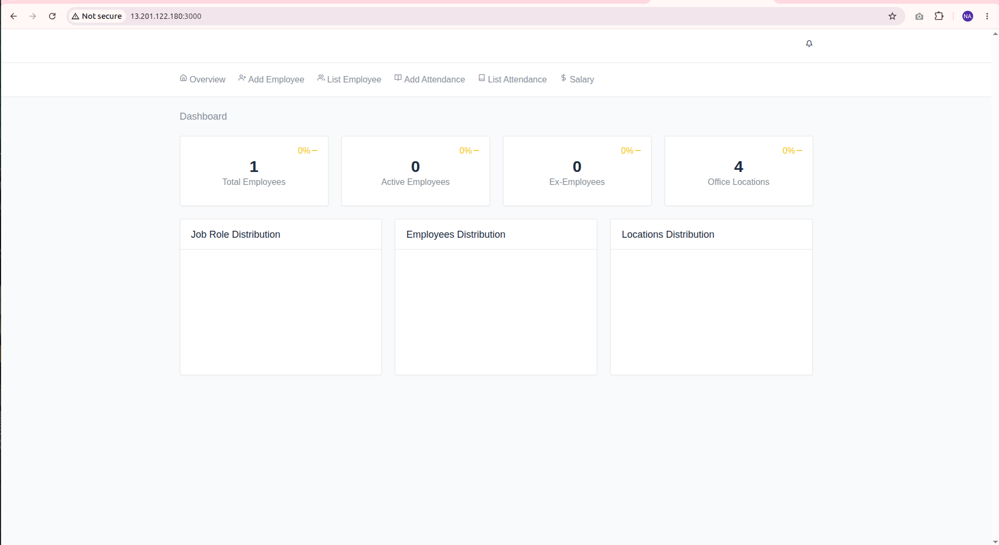
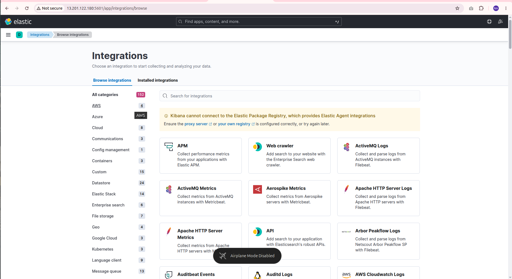
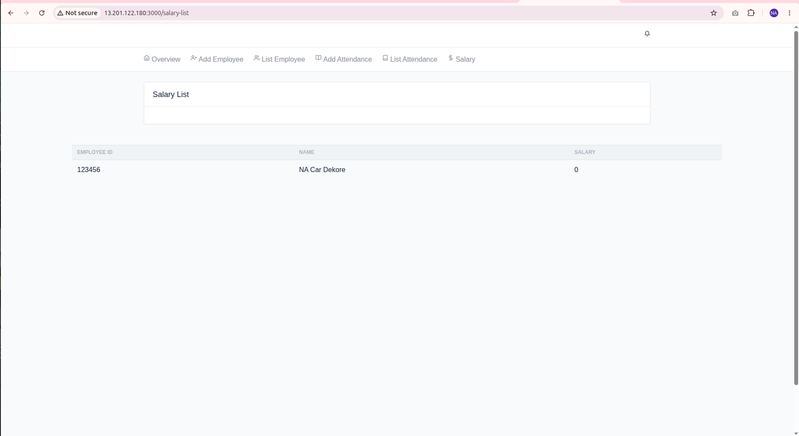

# Assignment 4 - Docker Compose (OT-Microservices)

## Overview

In this assignment, I deployed the **OT-Microservices** application using **Docker Compose**. During the setup, I faced multiple errors, fixed them one by one, and successfully ran the application in the browser. After that, I built Docker images, pushed them to Docker Hub, and verified that the application could run without the project source code.

---

# Repository

Original Repository:

https://github.com/opstree/OT-Microservices

---

# Step 1 - Clone and Run the Project

- Cloned the project from GitHub.
- Built the Docker images.
- Started all containers using Docker Compose.
- Verified that all services were running.

```bash
git clone https://github.com/opstree/OT-Microservices.git
cd OT-Microservices
docker compose up --build -d
```

---

# Step 2 - Fix Issues

While running the project, I encountered several issues. I resolved them one by one, including:

- Docker Compose configuration issues
- Traefik routing issues
- Database connection issues
- Elasticsearch startup issues
- Environment variable configuration
- Container networking issues
- Volume mount issues
- Service startup errors

After fixing these problems, the application started successfully and was accessible in the browser.

---

# Step 3 - Push Docker Images

After the application was working correctly, Pushed them to my Docker Hub repository.



The same process was followed for the other services.

---

# Step 4 - Run Without Source Code

- Deleted the project source code from my local machine.
- Updated the `docker-compose.yml` file to use the images from Docker Hub.
- Started the application successfully using only the Docker images.

---

# Step 5 - Buddy Verification

My buddy tested the project on another system.

- Did not clone the GitHub repository.
- Used only the `docker-compose.yml` file.
- Pulled the images from Docker Hub.
- Successfully ran the complete application.

---

# Commands Used

```bash
docker compose build
docker compose up -d
docker compose down
docker ps
docker compose logs -f
```

---

# Screenshots

- Docker Compose Running
- Running Containers
- Application Home Page
- Docker Images
- Docker Hub Repository








- Buddy Running the Application






---

# What I Learned

- Working with Docker Compose
- Building Docker images
- Pushing images to Docker Hub
- Running multi-container applications
- Troubleshooting Docker-related issues
- Running an application without the source code using Docker images

---

# Conclusion

I successfully deployed the OT-Microservices application using Docker Compose. After fixing multiple setup issues, the application worked correctly in the browser. I then built and pushed Docker images to Docker Hub, allowing the application to run without the original source code. Finally, my buddy successfully ran the project using only the Docker Compose file and the published Docker images.
