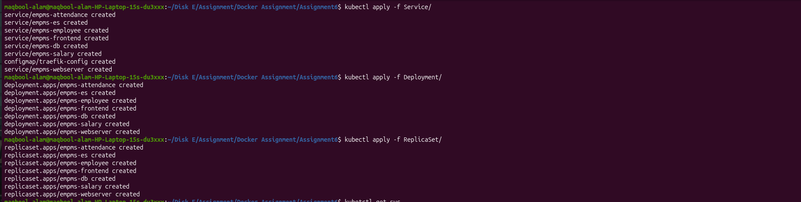
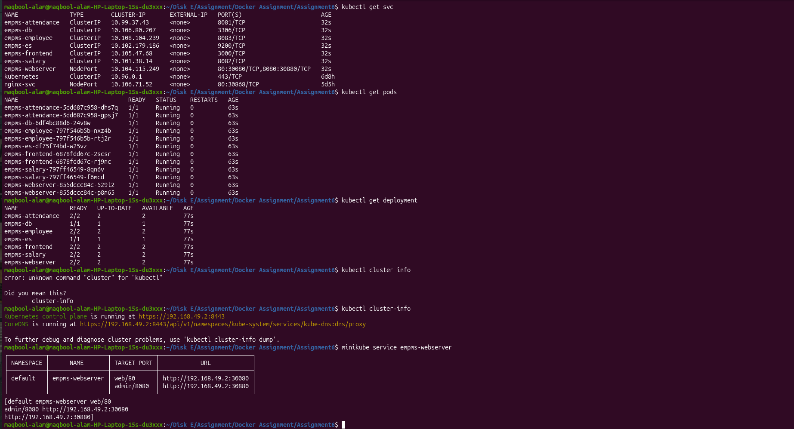
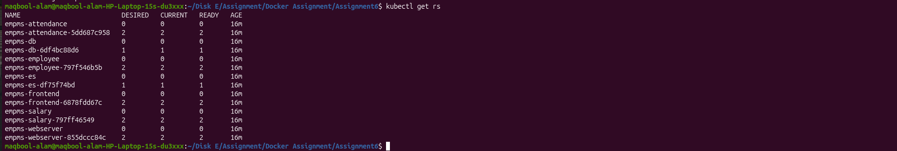
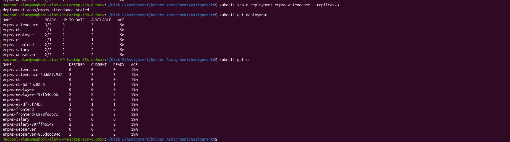
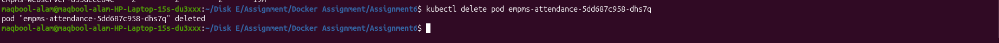
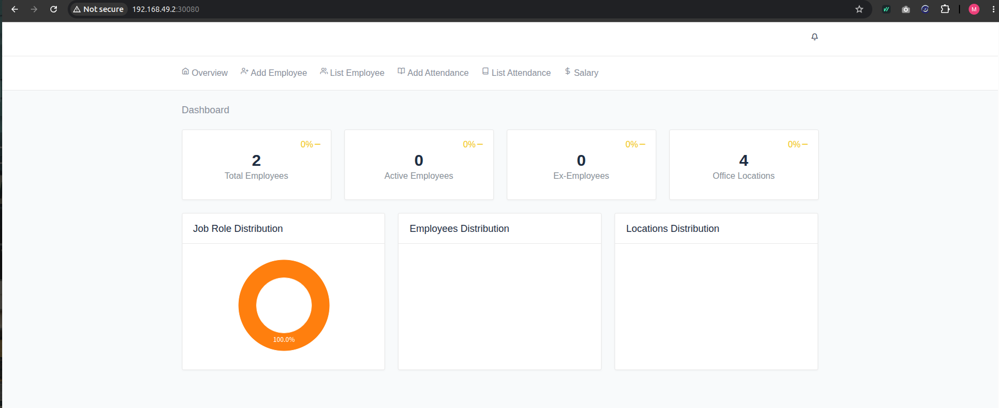
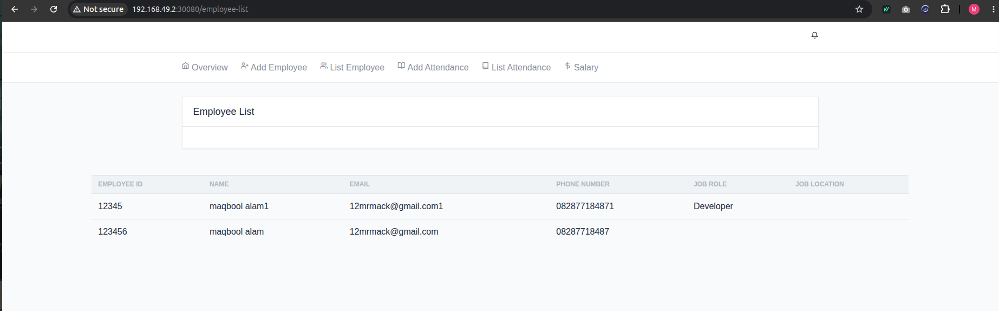
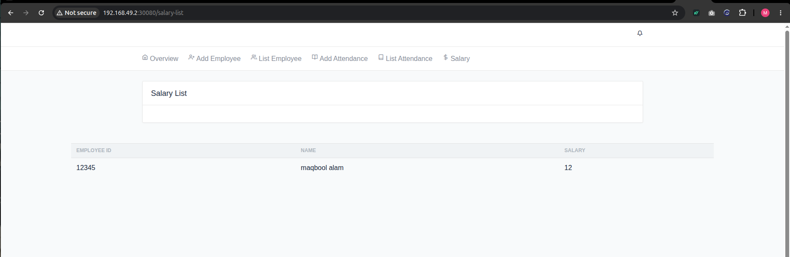

<<<<<<< HEAD
# Docker_34
contains assignment of Topic Docker
=======
# Assignment 6 - OT Microservices using ReplicaSet and Deployment

## Objective

The objective of this assignment is to learn how **ReplicaSet** and
**Deployment** work in Kubernetes.

I deployed the OT-Microservices application using two different
approaches:

1.  ReplicaSet
2.  Deployment

# Project Structure

    Assignment6
    ├── ReplicaSet
    └── Deployment
    └── Service

# Step 1 - Deploy ReplicaSet, Deployment, Service

``` bash
kubectl apply -f ReplicaSet/
kubectl apply -f Deployment/
kubectl apply -f Service/
kubectl get rs
kubectl get pods
kubectl get svc
```





# Scaling

``` bash
kubectl scale deployment attendance --replicas=3
kubectl get pods
```
 

# Delete Pod Test

``` bash
kubectl delete pod <pod-name>
kubectl get pods
```
 


ReplicaSet/Deployment automatically creates a new Pod.


# working website






# Conclusion

-   ReplicaSet keeps the required number of Pods running.
-   Deployment manages ReplicaSets and supports scaling, rolling
    updates, and rollback.
-   The OT-Microservices application was deployed successfully using
    both approaches.
>>>>>>> 902b952 (all docker and k8s assignments)
