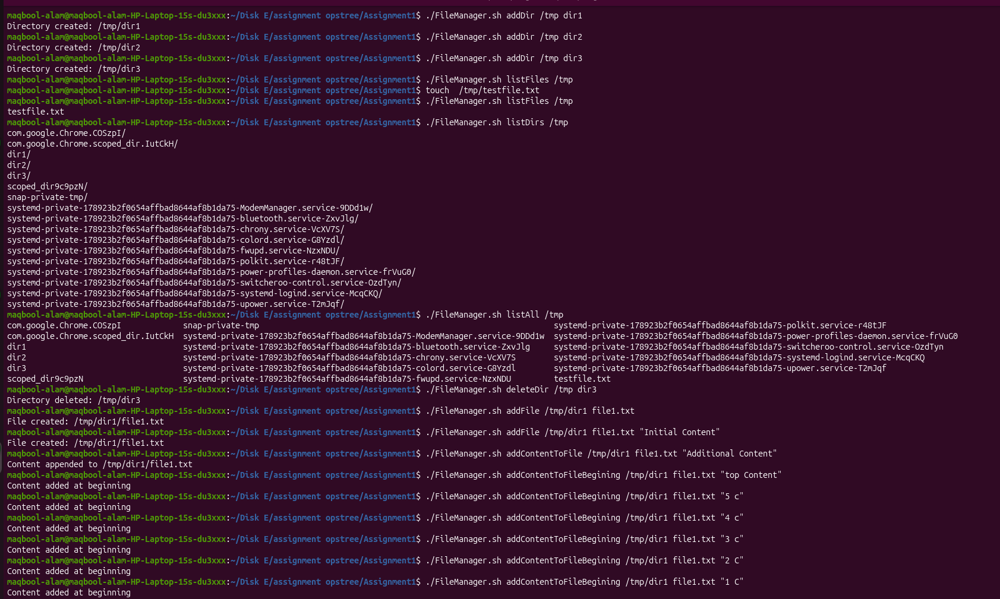
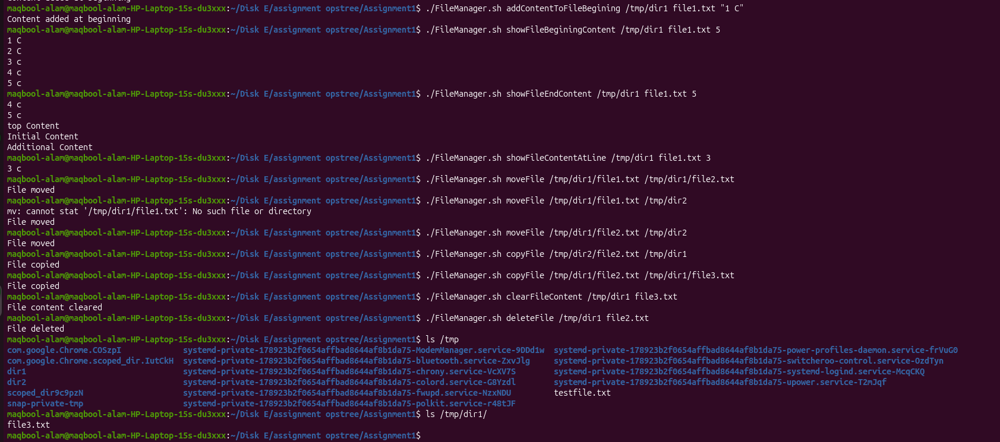

## Assignment 1 - FileManager Utility

Created a utility (**FileManager.sh**) that allows user to manage directories, perform file operations and read specific file content.

### Usage

```bash
./FileManager.sh <operation> <arguments> 
```

### Screenshots




