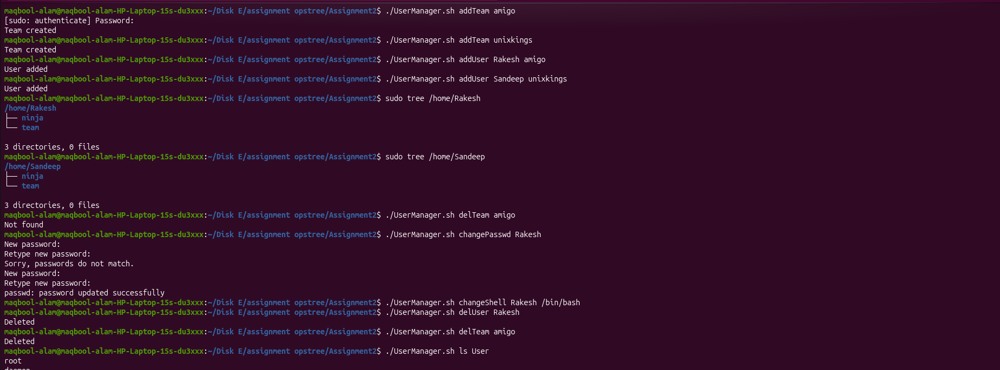

# UserManager.sh

## Overview

Simple shell script to manage **users and teams** with proper permissions and shared folders.

---

## ⚙️ Features

* Add Team (Group)
* Add User to Team
* Delete User / Team
* Change Password / Shell
* List Users / Teams

---

## 📁 Structure

```
/home
  ├── Rakesh
  │    ├── team
  │    └── ninja
  └── Sandeep
       ├── team
       └── ninja
```

---

## 🔐 Permissions

* User → Full access (rwx)
* Team → Read + Execute
* Others → Execute only

chmod +x UserManager.sh


## Create Teams
./UserManager.sh addTeam amigo
./UserManager.sh addTeam unixkings

## Add User
./UserManager.sh addUser Rakesh amigo
./UserManager.sh addUser Sandeep unixkings

## list
./UserManager.sh ls User
./UserManager.sh ls Team

## Change password And Shell
./UserManager.sh changePasswd Rakesh
./UserManager.sh changeShell Rakesh /bin/bash

## Delete
./UserManager.sh delUser Rakesh
./UserManager.sh delTeam amigo

### Screenshots




