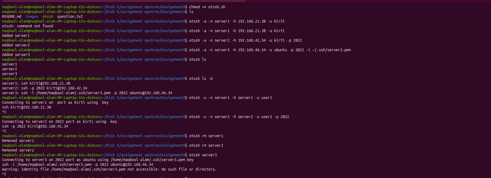

## Assignment 4 - otssh Utility

Created a utility (**otssh**) to manage SSH connections in a simple and reusable way.

The utility allows users to store, update, delete, list, and connect to SSH servers using predefined configurations.

---

## Features

- Add SSH connection
- List SSH connections
- Update SSH connection
- Delete SSH connection
- Connect to saved server

---

## Usage

```bash
./otssh <operation> <arguments>
```

### Example Commands

### Add connections

```bash
otssh -a -n server1 -h 192.168.21.30 -u kirti
otssh -a -n server2 -h 192.168.42.34 -u kirti -p 2022
otssh -a -n server3 -h 192.168.46.34 -u ubuntu -p 2022 -i ~/.ssh/server3.pem
```
### list servers

```bash
otssh ls
```

### list servers with detail

```bash
otssh ls -d
```

### Update Server

```bash
otssh -u -n server1 -h server1 -u user1
otssh -u -n server2 -h server2 -u user2 -p 2022
```
### Delete Server

```bash
otssh rm server1
otssh rm server2
```

### Connect Server

```bash
otssh server3
```

### Screenshots



