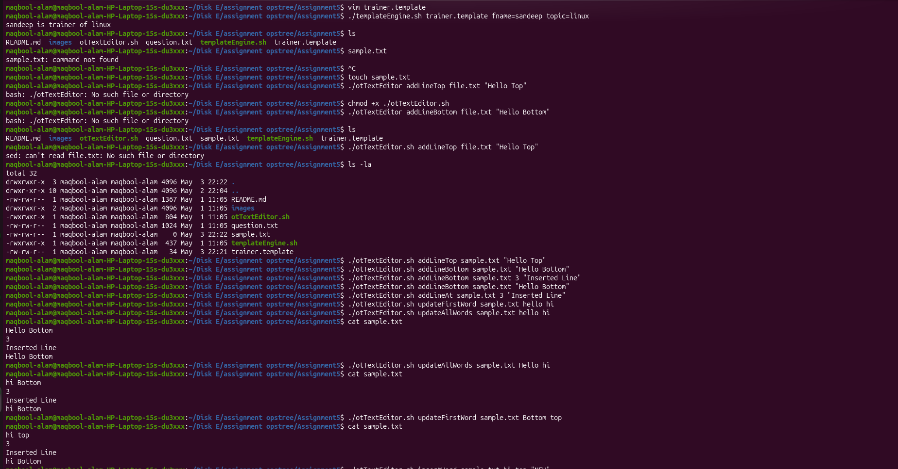

## Assignment 5 - Template Engine & Text Editor Utility

Created two shell utilities:

- **templateEngine.sh** → Processes template files and replaces variables dynamically
- **otTextEditor** → Performs various text editing operations on files

---

## Part A - Template Engine Utility

Generates output from a template file by replacing variables with provided values.

### Usage

```bash
./templateEngine.sh <template_file> key1=value1 key2=value2 ...
```

### Example Template

```bash
{{fname}} is trainer of {{topic}}
```

### Example Command

```bash
./templateEngine.sh trainer.template fname=sandeep topic=linux
```
### Screenshots


## Part B - Text Editor Utility

Performs multiple text editing operations on a given file.

### Usage 

```bash
./otTextEditor <operation> <arguments>
```

### Example Commands

```bash
./otTextEditor addLineTop file.txt "Hello World"
./otTextEditor addLineBottom file.txt "End Line"

./otTextEditor addLineAt file.txt 3 "Inserted Line"

./otTextEditor updateFirstWord file.txt old new
./otTextEditor updateAllWords file.txt old new

./otTextEditor insertWord file.txt word1 word2 insertedWord

./otTextEditor deleteLine file.txt 2
./otTextEditor deleteLine file.txt 2 keyword
```

### Screenshots



