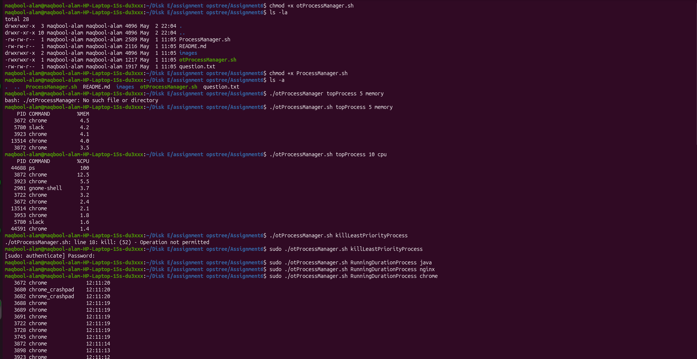
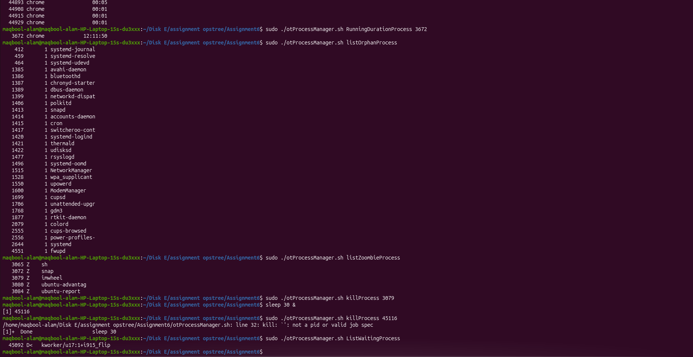
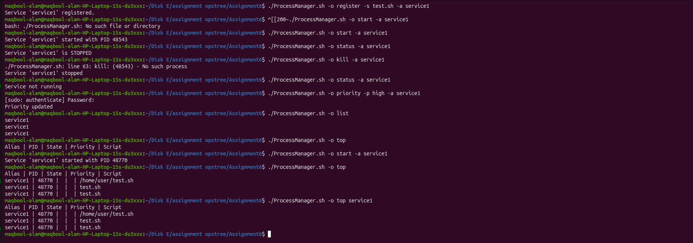
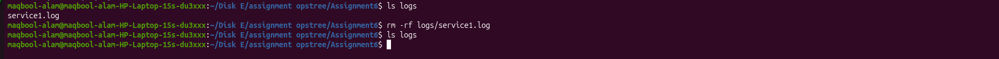

## Assignment 6 - Process Management Utility

Created two shell utilities:

- **otProcessManager** → Performs various process inspection and control operations
- **ProcessManager.sh** → Manages custom services as daemon processes

---

## Part A - otProcessManager Utility

Provides commands to inspect and manage system processes.

### Usage

```bash
./otProcessManager <operation> <arguments>
```

### Supported Operations

- Top processes by memory usage
- Top processes by CPU usage
- Kill process with least priority
- Get running duration of a process (by name or PID)
- List orphan processes
- List zombie processes
- Kill process by name or PID
- List processes waiting for resources

### Example Commands

```bash
./otProcessManager topProcess 5 memory
./otProcessManager topProcess 10 cpu

./otProcessManager killLeastPriorityProcess

./otProcessManager RunningDurationProcess nginx
./otProcessManager RunningDurationProcess 1234

./otProcessManager listOrphanProcess
./otProcessManager listZoombieProcess

./otProcessManager killProcess nginx
./otProcessManager killProcess 1234

./otProcessManager ListWaitingProcess
```

### Screenshots




## Part B - ProcessManager Utility

Manages custom services as daemon processes with alias-based control.

### Usage 

```bash
./ProcessManager.sh -o <operation> <arguments>
```

### Supported Operations

- Register a service (script path + alias)
- Start a service
- Check service status
- Stop (kill) a service
- Change service priority
- List all registered services
- Show detailed process information

### Example Commands

```bash
./ProcessManager.sh -o register -s /path/to/script.sh -a service1
./ProcessManager.sh -o start -a service1

./ProcessManager.sh -o status -a service1

./ProcessManager.sh -o kill -a service1

./ProcessManager.sh -o priority -p high -a service1

./ProcessManager.sh -o list
```

### Screenshots




## Part C- Playing with Processes

### Screenshots


