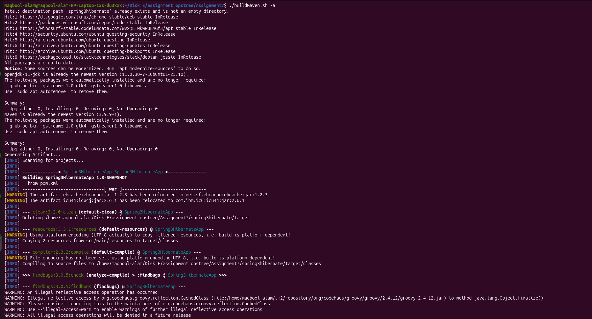
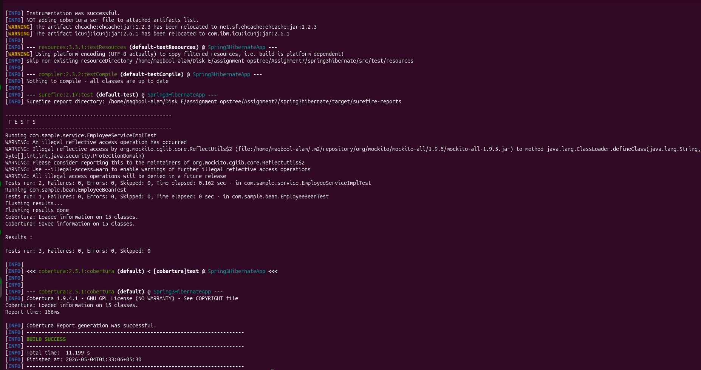
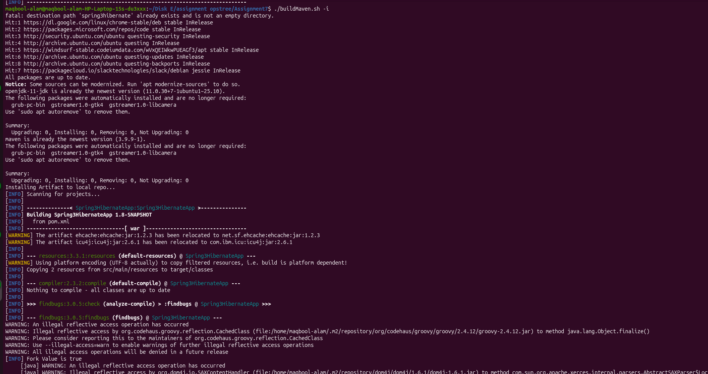

## Assignment 7 - Maven Build Automation Utility

Created a utility (**buildMaven.sh**) to manage build operations for a Maven-based Java project.

This utility automates common DevOps tasks such as building artifacts, running static code analysis, executing tests, and deploying applications.

---

## Features

- Generate project artifact
- Install artifact to local Maven repository
- Perform static code analysis
  - checkstyle
  - findbugs
  - pmd
- Perform unit testing
  - Unit tests
  - Code coverage
- Deploy artifact to web server (Tomcat)

## Repository

```bash
https://github.com/opstree/spring3hibernate.git
```
### Usage

```bash
./buildMaven.sh <flag> <arguments>
```

### Supported Flags 

- -a → Generate artifact
- -i → Install artifact to local repo
- -s → Static code analysis tool
- -t → Run unit tests
- -d → Deploy artifact to Tomcat

### Example Commands

```bash
./buildMaven.sh -a
./buildMaven.sh -i
./buildMaven.sh -s checkstyle
./buildMaven.sh -s findbugs
./buildMaven.sh -s pmd
./buildMaven.sh -t
```

### Screenshots



